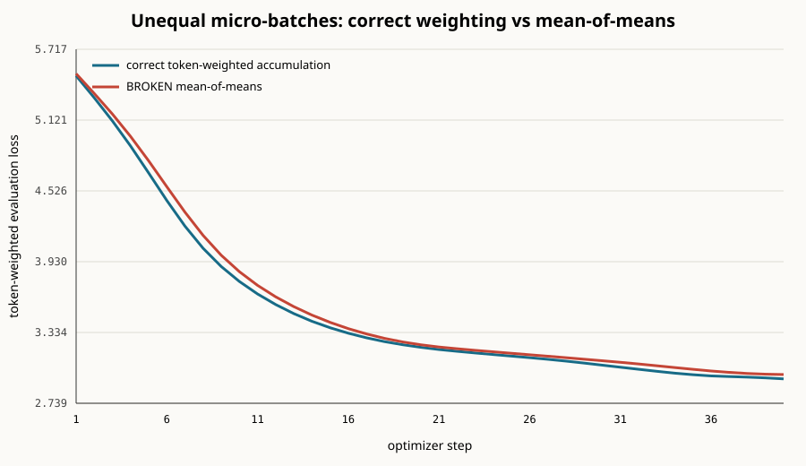
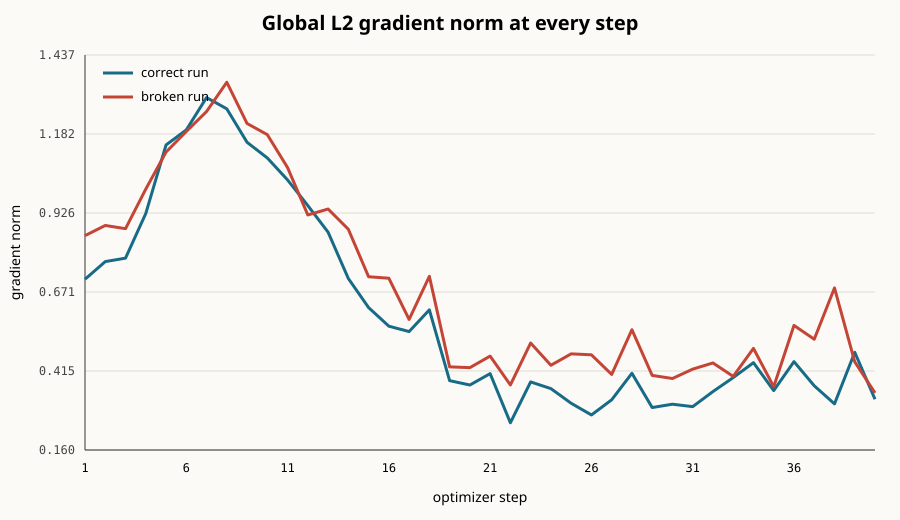

# A tiny Transformer tells the truth about one training step

This repository is a measured, reproducible answer to the assignment. It trains a
136,960-parameter byte-level causal Transformer (2 layers, 4 heads, width 64) on a
small frozen text shard. The saved run used PyTorch 2.5.1, FP32, and an NVIDIA
GeForce RTX 3070 Laptop GPU. Both accumulation experiments start from identical
weights and see identical batches.

The headline result is simple: the numerics check out, the deliberately wrong
objective produces a visible gap, and this model is much too small to use the GPU
well.

## Requirement coverage

| Session 10 requirement | Evidence in this repository |
|---|---|
| small model and real loop | 136,960-parameter causal Transformer, real text, forward/backward/AdamW loop |
| every tensor shape and dimension meaning | 250-line shape ledger covering both micro-batches and optimizer state |
| one gradient checked by hand | central finite difference agrees with `backward()` to about 10 decimals |
| break unequal-length accumulation | correct and mean-of-means runs plotted from identical initialization/batches |
| grad norm every step | 40-row CSV and plot, with step 38→39 discussed explicitly |
| own MFU and distance to 40% | Session 10 `6N` MFU plus architecture-aware cross-check and bottleneck analysis |
| bits for 0.1 and training choice | fp32, bf16, E4M3 fields and stored values; BF16 choice explained |
| GitHub-style repo, README, notebook | local Git history, this README, and executed `.ipynb` included |

## Reproduce

```bash
python -m venv .venv
# activate the environment, then:
pip install -r requirements.txt
python experiment.py --steps 40 --device auto
```

The experiment has a text fallback if the included corpus shard is removed. On a
CPU, use `--device cpu`; the script reports that the CUDA MFU measurement is
unavailable rather than inventing one.

## 1. Every tensor shape in the audited step

The audited micro-batch uses:

- `B=16`: independent sequences in the micro-batch
- `T=64`: byte-token positions per sequence
- `C=64`: model channels
- `H=4`: attention heads
- `D=16`: channels per head (`C/H`)
- `M=256`: expanded MLP channels (`4C`)
- `V=256`: possible UTF-8 byte values

The run printed **250 tensor entries**. This includes both forward graphs in the
optimizer step (`T=8` and `T=64`), both token-weighted loss contributions, the
accumulated gradient-norm scalars, every parameter, every gradient, and every
tensor-valued AdamW state after the update. Each line
contains the literal shape, dtype, and the meaning of every dimension. The complete
printout is in [`artifacts/shape_ledger.txt`](artifacts/shape_ledger.txt) and is also
printed in full in the notebook.

A representative slice:

| Tensor | Shape | Dimensions mean |
|---|---:|---|
| `microbatch_0_short.input_ids` | `(16, 8)` | batch, sequence |
| `microbatch_0_short.block_0.attention_scores` | `(16, 4, 8, 8)` | batch, head, query position, key position |
| `microbatch_1_long.token_embedding` | `(16, 64, 64)` | batch, sequence, model channel |
| `microbatch_1_long.block_0.q` | `(16, 4, 64, 16)` | batch, attention head, query position, head channel |
| `microbatch_1_long.block_0.attention_scores` | `(16, 4, 64, 64)` | batch, head, query position, key position |
| `microbatch_1_long.block_0.mlp_up` | `(16, 64, 256)` | batch, sequence, expanded MLP channel |
| `microbatch_1_long.logits` | `(16, 64, 256)` | batch, sequence, byte vocabulary |
| `microbatch_1_long.per_token_cross_entropy` | `(1024,)` | batch-times-sequence |
| `accumulation.global_gradient_l2_norm` | `()` | scalar |
| `gradient.lm_head.weight` | `(256, 64)` | output byte vocabulary, input model channel |
| `optimizer.exp_avg.lm_head.weight` | `(256, 64)` | output byte vocabulary, input model channel |

The shape trace is explicit code, not a profiler guess: see `record(...)`,
`Block.forward(...)`, and `add_backward_and_optimizer_shapes(...)` in
[`experiment.py`](experiment.py).

## 2. One gradient checked by hand

I checked `lm_head.weight[105, 0]` in float64 with a central difference and
`epsilon = 1e-5`:

$$
\frac{\partial L}{\partial w} \approx
\frac{L(w+\epsilon)-L(w-\epsilon)}{2\epsilon}
$$

Measured values:

| Quantity | Value |
|---|---:|
| `L(w + epsilon)` | 5.659547824005586 |
| `L(w - epsilon)` | 5.659547552736764 |
| finite difference | 0.01356344112579677 |
| `backward()` | 0.013563441054856254 |
| absolute error | 7.094051561462589e-11 |
| relative error | 5.230274158060207e-9 |

They agree through roughly ten decimal places. Central difference is used instead
of a one-sided nudge because its truncation error is quadratic in `epsilon`.

## 3. Breaking accumulation with an average of averages

There are two micro-batches per optimizer step: `(B=16, T=8)` and `(B=16, T=64)`.
The correct loss is

$$
L_{\text{correct}} =
\frac{\sum L_{\text{short}}+\sum L_{\text{long}}}
{N_{\text{short}}+N_{\text{long}}}
$$

The deliberately broken loss is

$$
L_{\text{broken}} =
\frac{1}{2}\,\text{mean}(L_{\text{short}}) +
\frac{1}{2}\,\text{mean}(L_{\text{long}})
$$

The short source owns only `128 / 1152 = 11.11%` of the tokens, but the broken
objective gives it 50% of the gradient. Because the two lengths sample different
regions of the corpus, that is not just a rescaling: it changes the objective.
Evaluation uses the correct token weighting.



After 40 steps, correct evaluation loss is **2.94407** and broken evaluation loss
is **2.98044**: an absolute gap of **0.03637**, or **1.235%** relative to the correct
run. Raw values for every step are in
[`artifacts/training_log.csv`](artifacts/training_log.csv).

## 4. Gradient norm at every step

The global L2 norm is computed after both micro-batches have accumulated and before
`optimizer.step()`. Every value is in the CSV above and plotted here:



The clearest “moved before the loss did” example is step 38 to 39:

- evaluation loss: `2.958693 -> 2.952354`, continuing its smooth decline by only
  **0.214%**
- gradient norm: `0.309012 -> 0.475860`, an abrupt **53.994% spike**

The relative grad-norm signal is about 252 times the relative loss movement. The loss
does not show a corresponding warning—it still looks healthy—while the gradient trace
immediately says that this batch produced a very different update. This is an observed
leading diagnostic, not a claim that the short run later failed.

## 5. My MFU calculation

The benchmark uses a fixed `B=32, T=64` batch, 20 warm-up steps, then 60 individually
synchronized steps. TF32 is disabled, so I compare against an FP32 CUDA-core peak.
I use the Session 10 convention as the primary result:

$$
F_{\text{train/token}} \approx 6N
= 6 \times 136{,}960
= 821{,}760
$$

As a cross-check, counting this architecture's matrix multiplications explicitly,
one forward token costs:

$$
F_{\text{forward/token}} = L(24d^2+4Td)+2dV = 262{,}144
$$

Approximating backward as twice forward gives `786,432` FLOPs/token by that second
method. The two estimates differ by 4.5%, mostly because `6N` treats every parameter
uniformly while embedding lookup is not a dense matrix multiplication.

The measured median step is 8.860 ms for 2,048 tokens, or 231,153 tokens/s. With
the lesson's `6N` estimate, that yields **0.18995 TFLOP/s**.

The device reports 40 SMs and a 2.1 GHz maximum SM clock. For compute capability
8.6 I use 128 FP32 lanes/SM, giving this upper bound:

$$
F_{\text{peak}} = 40 \times 128 \times 2 \times 2.1\text{ GHz}
= 21.504\text{ TFLOP/s}
$$

Therefore:

$$
MFU_{6N}
= \frac{0.18995}{21.504}
= \mathbf{0.883\%}
$$

The explicit architecture-aware count gives 0.18179 TFLOP/s and **0.845% MFU**, so
the conclusion is insensitive to the counting convention. This is honest but
approximate: the numerator excludes layer norm, softmax, GELU, AdamW, and memory
traffic even though they consume wall time. The denominator is a driver-clock upper
bound, not a guaranteed sustained clock.

Why it is nowhere near 40%: the model's `64 x 64`-scale matrix multiplies are tiny;
Python launches many separate kernels; attention explicitly materializes small
`T x T` matrices; batch and sequence length are too small to fill the GPU; and this
audit-friendly FP32 implementation does not use fused attention, fused optimizer
kernels, compilation, mixed precision, or Tensor Cores. At 40% this denominator
would require 8.6016 TFLOP/s—about 45 times the achieved rate. The primary cost is
under-utilization and launch/memory overhead, not a shortage of arithmetic.

## 6. What decimal 0.1 looks like

Binary `0.1` repeats: `0.0001100110011..._2 = 1.100110011... x 2^-4`. Rounding that
repeating fraction gives:

| Format | sign · exponent · fraction | Hex | Stored decimal |
|---|---|---:|---:|
| fp32 | `0 01111011 10011001100110011001101` | `0x3DCCCCCD` | 0.10000000149011612 |
| bf16 | `0 01111011 1001101` | `0x3DCD` | 0.10009765625 |
| fp8 E4M3 | `0 0011 101` | `0x1D` | 0.1015625 |

For fp32 and bf16 the stored exponent is `-4 + 127 = 123 = 01111011`. For E4M3
the bias is 7, so it is `-4 + 7 = 3 = 0011`; the ideal fraction `0.6 x 8 = 4.8`
rounds to `5 = 101`, giving `(1 + 5/8) x 2^-4 = 0.1015625`. PyTorch's
`float8_e4m3fn` conversion independently returns the same value.

I would train this model in **bf16 for weights, activations, and gradients, with
FP32 optimizer states and sensitive reductions** on hardware that accelerates it.
BF16 keeps fp32's 8-bit exponent range, halves storage/bandwidth, and is much more
forgiving than FP8. I would not use raw E4M3 here: three fraction bits make 0.1 about
1.56% high and the narrow range needs a deliberate scaling recipe. This particular
audit run stays in FP32 so the gradient check and FP32 MFU denominator are easy to
interpret.

## Repository map

- [`small_model_truth.ipynb`](small_model_truth.ipynb) — executed review notebook
- [`UNDERSTANDING_THE_NUMBERS.md`](UNDERSTANDING_THE_NUMBERS.md) — slow walkthrough and experiments to try
- [`experiment.py`](experiment.py) — model, training loops, checks, MFU, and plots
- [`verify_submission.py`](verify_submission.py) — fast consistency checks for saved artifacts
- [`artifacts/results.json`](artifacts/results.json) — machine-readable summary
- [`artifacts/shape_ledger.txt`](artifacts/shape_ledger.txt) — all 250 shape lines
- [`artifacts/training_log.csv`](artifacts/training_log.csv) — loss and grad norm at every step
- [`data/README.md`](data/README.md) — data provenance and fallback behavior

No claim here depends on a screenshot: the raw measurements, formulas, and code that
produced them are all in the repository.
