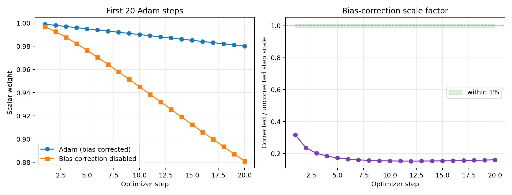
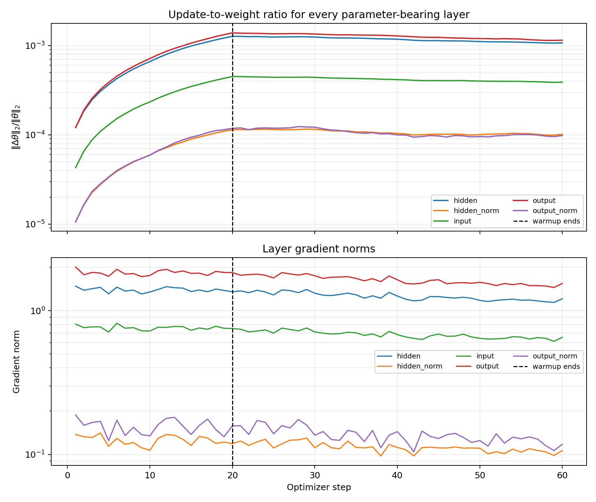
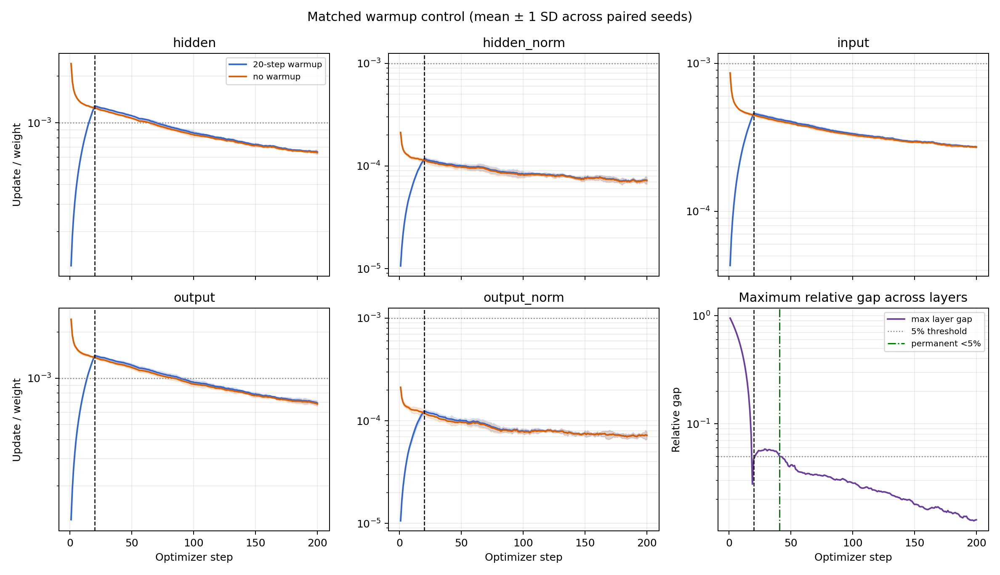
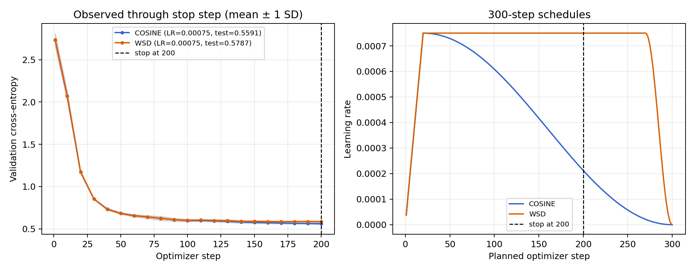
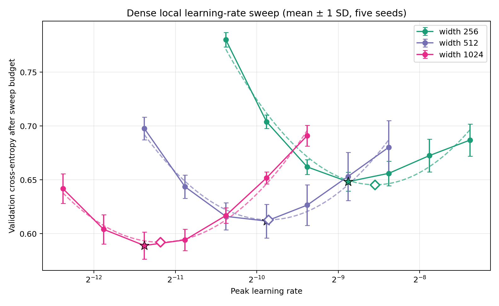

# Assignment 11 — Adam, warmup, schedules, and width scaling

All five assignment questions are answered directly below. Supporting methodology, uncertainty analysis, reproducibility details, and limitations are in [`METHODS_AND_REPRODUCIBILITY.md`](METHODS_AND_REPRODUCIBILITY.md).

## Answers at a glance

| assignment question | answer |
|---|---|
| Does the hand-written Adam calculation agree with PyTorch? | **Yes. Maximum absolute error: 4.81e-17.** |
| When does Adam bias correction stop mattering? | **Step 3,916**, using a permanent less-than-1% update-scale criterion. |
| When does warmup stop changing update-to-weight ratios? | **Step 41 empirically** under the matched-control 5% criterion; **step 20** is the exact LR schedule boundary. |
| Which step-200 checkpoint should be kept, cosine or WSD? | **Cosine:** test loss 0.55906 versus 0.57866 for WSD. |
| Which LR should be used at width 4,096? | Approximately **7e-5**; low-to-moderate confidence on this task and low external confidence. |

## 1. Reproduce Adam by hand and check against PyTorch

**Question.** Take one weight and five gradients; compute `m`, `v`, bias-corrected `m_hat`, bias-corrected `v_hat`, and the resulting step by hand, then compare each with PyTorch.

**Inputs**

```text
w_0 = 1.0
gradients = [0.50, 0.40, 0.60, 0.45, 0.55]
learning rate = 0.001
beta1 = 0.9, beta2 = 0.999, epsilon = 1e-8
```

**Equations**

```text
m_t      = beta1*m_(t-1) + (1-beta1)*g_t
v_t      = beta2*v_(t-1) + (1-beta2)*g_t^2
m_hat_t  = m_t / (1-beta1^t)
v_hat_t  = v_t / (1-beta2^t)
step_t   = learning_rate*m_hat_t / (sqrt(v_hat_t)+epsilon)
w_t      = w_(t-1) - step_t
```

**Hand calculation**

| step | gradient | `m_t` | `v_t` | `m_hat_t` | `v_hat_t` | weight change | weight after |
|---:|---:|---:|---:|---:|---:|---:|---:|
| 1 | 0.50 | 0.050000 | 0.000250000 | 0.500000 | 0.250000 | -0.001000000 | 0.999000000 |
| 2 | 0.40 | 0.085000 | 0.000409750 | 0.447368 | 0.204977 | -0.000988126 | 0.998011874 |
| 3 | 0.60 | 0.136500 | 0.000769340 | 0.503690 | 0.256703 | -0.000994140 | 0.997017734 |
| 4 | 0.45 | 0.167850 | 0.000971071 | 0.488078 | 0.243132 | -0.000989847 | 0.996027887 |
| 5 | 0.55 | 0.206065 | 0.001272600 | 0.503199 | 0.255030 | -0.000996425 | 0.995031463 |

**Answer.** Every requested quantity agrees with float64 `torch.optim.Adam`. The largest absolute error across all rows and quantities is **4.81e-17**, considerably better than several decimal places.

Evidence: [`artifacts/adam_hand_vs_pytorch.csv`](artifacts/adam_hand_vs_pytorch.csv).

## 2. Disable bias correction and plot the first 20 steps

**Question.** Plot the first twenty Adam steps with and without bias correction and report when the difference stops mattering.



Without correction, the update is:

```text
learning_rate*m_t / (sqrt(v_t)+epsilon)
```

**Answer.** I define “stops mattering” as the first step where bias correction changes the instantaneous update scale by less than 1% and stays below 1% thereafter. For `beta1=0.9` and `beta2=0.999`, this occurs at **step 3,916**.

The answer depends on the chosen tolerance: step 1,660 at 10%, step 2,327 at 5%, step 3,916 at 1%, and step 6,213 at 0.1%. This criterion concerns the current update; previously accumulated differences in the weight trajectories do not disappear.

Evidence: [`artifacts/bias_correction_first_20.csv`](artifacts/bias_correction_first_20.csv) and [`artifacts/bias_correction_threshold_sensitivity.csv`](artifacts/bias_correction_threshold_sensitivity.csv).

## 3. Log every layer's update-to-weight ratio

**Question.** Log the update-to-weight ratio for every layer and identify the step at which warmup stops changing it.

```text
update-to-weight ratio = ||weight_after-weight_before||_2 / ||weight_before||_2
```



I also ran a five-seed matched control with and without warmup. The model, initial weights, minibatches, optimizer, and peak LR are identical within each pair.



**Answer.** The LR warmup reaches its full value at **step 20**, so warmup stops directly multiplying the update there. Its path-dependent effect on the measured ratios persists slightly longer: the warmup/no-warmup mean ratio gap stays below 5% for every layer and every remaining observed step starting at **step 41**. Thus, **step 41 is the empirical answer**, while step 20 is the exact schedule boundary.

Evidence: [`artifacts/layer_update_weight_ratios.csv`](artifacts/layer_update_weight_ratios.csv) and [`artifacts/warmup_control_gap.csv`](artifacts/warmup_control_gap.csv).

## 4. Compare tuned cosine and WSD schedules at step 200

**Question.** Train the same model with a 300-step cosine schedule and a 300-step WSD schedule, stop both at step 200, report both losses, and state which model to keep.

Both schedules received the same seven-LR tuning grid and three tuning seeds. Both independently selected peak LR `7.5e-4`. Final evaluation used five new paired seeds and a held-out test set that was not used for tuning.



| schedule | validation loss, mean ± SD | held-out test loss, mean ± SD | test-mean bootstrap 95% CI |
|---|---:|---:|---:|
| cosine | 0.56096 ± 0.01121 | **0.55906 ± 0.01254** | [0.54981, 0.56964] |
| WSD | 0.58546 ± 0.01410 | 0.57866 ± 0.01347 | [0.56936, 0.59043] |

The paired cosine-minus-WSD test-loss difference is `-0.01961`, bootstrap 95% interval `[-0.02156, -0.01765]`.

**Answer. Keep the cosine checkpoint** if training ends at step 200. Its held-out loss is lower, and the five-seed paired interval favors cosine. This is specifically an early-stop result; it does not claim cosine would win after both schedules complete all 300 steps.

Evidence: [`artifacts/schedule_tuning.csv`](artifacts/schedule_tuning.csv), [`artifacts/schedule_final_paired.csv`](artifacts/schedule_final_paired.csv), [`artifacts/cosine_step_200.pt`](artifacts/cosine_step_200.pt), and [`artifacts/wsd_step_200.pt`](artifacts/wsd_step_200.pt).

## 5. Sweep learning rate across widths

**Question.** Sweep LR at widths 256, 512, and 1,024; mark the three minima; state the LR to use at width 4,096 and confidence in it.

Each width uses seven local LRs and five seeds per LR, totaling 105 runs. Stars in the plot mark the lowest tested means; hollow diamonds mark quadratic minima fitted in log-LR space.



| width | best tested LR | fitted LR minimum | fitted-minimum bootstrap 95% interval |
|---:|---:|---:|---:|
| 256 | 2.121e-3 | **2.669e-3** | [2.562e-3, 2.807e-3] |
| 512 | 1.061e-3 | **1.078e-3** | [1.024e-3, 1.155e-3] |
| 1,024 | 3.750e-4 | **4.298e-4** | [4.100e-4, 4.501e-4] |

The fitted minima imply `optimal LR(width) = C × width^-1.317`.

**Answer.** At width 4,096 I would use approximately **`7e-5`**. The continuous estimate is `6.94e-5`, with a seed-bootstrap interval of `[6.23e-5, 7.68e-5]`. Confidence is **low-to-moderate for this exact task and low externally**, because width 4,096 was not directly measured and only three widths determine the scaling exponent. A confirmation sweep should test approximately `3.5e-5`, `7e-5`, and `1.4e-4`.

Evidence: [`artifacts/width_lr_sweep_raw.csv`](artifacts/width_lr_sweep_raw.csv), [`artifacts/width_lr_sweep_summary.csv`](artifacts/width_lr_sweep_summary.csv), and [`artifacts/summary.json`](artifacts/summary.json).

## Reproduce the assignment

The exact train, validation, and test arrays are included in [`data/synthetic_teacher_v1.npz`](data/synthetic_teacher_v1.npz). Copy or clone the complete folder; do not copy only `experiment.py`. After obtaining the folder, open a terminal **inside the directory containing this README**.

### Windows PowerShell

```powershell
py -m venv .venv
.\.venv\Scripts\python -m pip install --upgrade pip
.\.venv\Scripts\python -m pip install -r requirements.txt
.\.venv\Scripts\python experiment.py --verify-data
.\.venv\Scripts\python -m unittest -v
.\.venv\Scripts\python experiment.py --device auto
```

This uses the Python version selected by the Windows launcher. To inspect available versions, run `py --list-paths`. If the launcher is unavailable, replace `py` with a locally installed Python executable.

### Linux or macOS

```bash
python3 -m venv .venv
./.venv/bin/python -m pip install --upgrade pip
./.venv/bin/python -m pip install -r requirements.txt
./.venv/bin/python experiment.py --verify-data
./.venv/bin/python -m unittest -v
./.venv/bin/python experiment.py --device auto
```

The data check must print:

```text
sha256:5482356c445d8bb9e29f969dc2da0958cac7740a44c62382d89df71af422bbb5
```

The reference snapshot-backed run used Python 3.10.14, PyTorch 2.5.1, NumPy 2.2.5, and Matplotlib 3.10.8. Eleven tests pass. Another CPU/GPU may produce tiny floating-point differences, but it receives identical data, seeds, initializations, and minibatches and should reproduce the conclusions and losses within normal numerical tolerance.

## Submission files

- [`experiment.py`](experiment.py): complete implementation.
- [`test_experiment.py`](test_experiment.py): eleven tests.
- [`requirements.txt`](requirements.txt): pinned dependencies.
- [`data/README.md`](data/README.md): bundled-data schema and integrity hashes.
- [`METHODS_AND_REPRODUCIBILITY.md`](METHODS_AND_REPRODUCIBILITY.md): tuning, uncertainty, reproducibility, and limitations.
- [`artifacts/summary.json`](artifacts/summary.json): machine-readable results.
