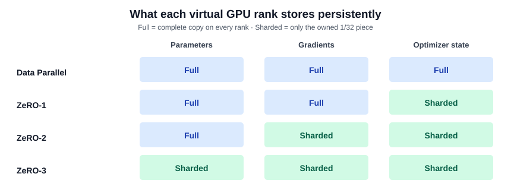
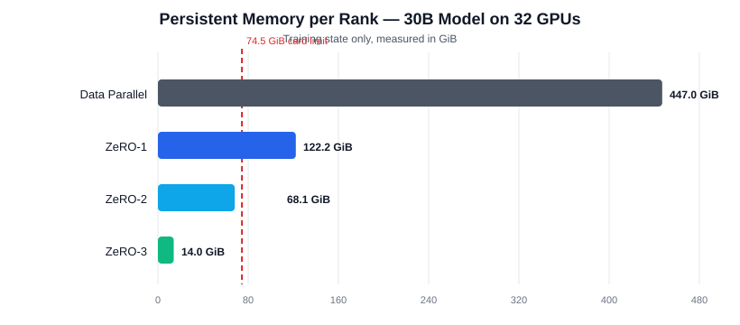
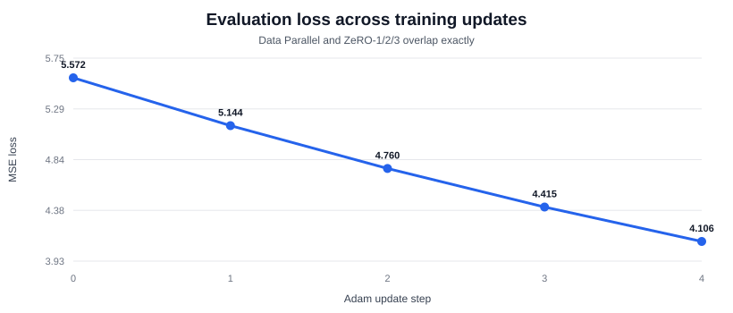

# Assignment 12: Data Parallelism and ZeRO on 32 Virtual GPUs

This project simulates distributed training with 32 CPU worker threads acting as virtual GPU ranks. I use a three-layer ReLU neural network and compare ordinary data parallelism with ZeRO stages 1, 2, and 3.

The purpose is to show what each rank owns, how much persistent memory it uses, how optimizer computation changes, which collective operations are required, and why every stage still produces the same mathematical update.

## Files

- `assignment_12_zero_simulation.ipynb` — complete executable experiment and explanation.
- `ownership_diagram.svg` — at-a-glance comparison of full versus sharded state.
- `loss_comparison.svg` — evaluation-loss curve across the four Adam updates.
- `memory_comparison.svg` — memory chart rendered directly in this README.
- `requirements.txt` — minimal environment requirements.

## How to run

### Google Colab

1. Open Google Colab.
2. Upload `assignment_12_zero_simulation.ipynb`.
3. Select **Runtime → Run all**.

Colab already provides NumPy. A GPU runtime is not required because the notebook intentionally uses CPU threads as virtual ranks.

### Local Jupyter

```bash
python -m venv .venv
.venv\Scripts\activate
pip install -r requirements.txt
jupyter notebook assignment_12_zero_simulation.ipynb
```

## What I built

- 32 simultaneous CPU worker threads, one for each virtual rank.
- A deterministic 2,048-parameter neural network: `16 → 32 → 32 → 16`.
- Three weight matrices with ReLU activations after the first two layers.
- A global batch split into 32 different microbatches.
- Separate forward and backward worker phases.
- A normal data-parallel implementation.
- ZeRO-1 with sharded FP32 master parameters and Adam states.
- ZeRO-2 with sharded optimizer state and gradients.
- ZeRO-3 with sharded parameters, gradients, and optimizer state.
- Explicit ZeRO-3 layer-by-layer parameter gathers during forward and backward.
- Four Adam training steps with optimizer state carried between steps.
- FP32 correctness checks for master parameters and both Adam moments.
- Measured toy-model state memory and projected 30B-model memory.
- A state-ownership diagram for Data Parallel and all three ZeRO stages.
- A per-step loss table and curve showing that all four strategies match.
- A bar chart comparing 30B per-rank memory across all four strategies.
- Example shard ranges for ranks 0, 1, 15, 30, and 31.
- Exact 32-rank ring communication estimates and the rounded Session 12 values.

The controller emulates collectives, while each rank owns real NumPy arrays and performs model or optimizer work on a worker thread. This is a conceptual simulator, not a GPU performance benchmark.

## Ownership at a glance

“Full” means that every rank stores a complete copy. “Sharded” means the 32 ranks divide that state, so each rank keeps only its assigned piece.

| Strategy | Parameters | Gradients | Optimizer state |
|---|---|---|---|
| Data Parallel | Full | Full | Full |
| ZeRO-1 | Full | Full | Sharded |
| ZeRO-2 | Full | Sharded | Sharded |
| ZeRO-3 | Sharded | Sharded | Sharded |



## Memory assumptions

The Session 12 accounting uses 16 bytes per parameter:

| State | Format | Bytes per parameter |
|---|---:|---:|
| Compute parameter | FP16 | 2 |
| Gradient | FP16 | 2 |
| Master parameter | FP32 | 4 |
| Adam first moment | FP32 | 4 |
| Adam second moment | FP32 | 4 |
| **Total** |  | **16** |

With world size `N`, persistent bytes per parameter per rank are:

| Strategy | Persistent bytes per parameter per rank |
|---|---:|
| Data parallel | `16` |
| ZeRO-1 | `4 + 12/N` |
| ZeRO-2 | `2 + 14/N` |
| ZeRO-3 | `16/N` |

## My understanding of the stages

### Data parallelism

Every rank stores the entire training state. Each rank processes a different microbatch and produces a full local gradient. An all-reduce averages those gradients and returns the same result to every rank. Because all replicas start with the same parameters and apply the same update, they remain synchronized.

This is the easiest strategy to reason about, but it wastes memory by replicating all 16 bytes per parameter on every rank. It also repeats the full optimizer update on every rank.

### ZeRO-1

ZeRO-1 shards the 12 optimizer bytes: the FP32 master parameter and the two FP32 Adam moments. Parameters remain replicated and each rank still allocates a full-sized local gradient buffer during backward. After reduce-scatter, only the owned averaged gradient shard is required for that rank's optimizer update; the simulator does not retain a full synchronized averaged gradient on every rank. The updated parameter shards are then all-gathered so that every rank again has a complete model.

The important result for me is that this first stage removes most of the redundant memory because optimizer state is 12 of the original 16 bytes.

### ZeRO-2

ZeRO-2 keeps optimizer sharding and also retains only each rank's gradient shard. The simulator uses reduce-scatter to average gradients while delivering rank `r` only the slice it owns. Parameters remain replicated, so forward and backward can still use a complete local model.

ZeRO-2 reduces memory further without increasing the simplified communication beyond roughly `2P` per step.

### ZeRO-3

ZeRO-3 shards every persistent state, including the FP16 parameters. A rank cannot perform the full model computation from its persistent state alone, so parameter shards must be all-gathered when they are needed.

The notebook explicitly gathers `W1`, `W2`, and `W3` one layer at a time during the forward pass, releasing each gathered layer after use. Backward repeats the process in reverse order: `W3`, `W2`, and `W1`. Gradients are reduce-scattered and each rank updates only its owned pieces from all three layers.

This provides the lowest persistent memory, but the extra parameter materialization raises communication from about `2P` to about `3P` per step. It also creates a transient memory peak equal to the gathered layer or bucket.

## Measured toy-model memory

The notebook creates actual per-rank arrays and sums their `nbytes` values:

| Strategy | Parameter bytes | Gradient bytes | Optimizer bytes | Persistent bytes per rank |
|---|---:|---:|---:|---:|
| Data parallel | 4,096 | 4,096 | 24,576 | 32,768 |
| ZeRO-1 | 4,096 | 4,096 | 768 | 8,960 |
| ZeRO-2 | 4,096 | 128 | 768 | 4,992 |
| ZeRO-3 | 128 | 128 | 768 | 1,024 |

Every strategy produces a temporary 4,096-byte full FP16 gradient before its collective. ZeRO-2 and ZeRO-3 can release non-owned gradient data after reduce-scatter; real implementations do this bucket by bucket during backward. ZeRO-3 gathers only the active layer, so its largest temporary FP16 parameter communication buffer is the 2,048-byte `W2` matrix rather than the 4,096-byte full model. The NumPy simulator converts that gathered layer to FP32 for CPU matrix multiplication, so this figure is conceptual GPU-style FP16 accounting rather than literal Python process memory. These temporary buffers are not counted as persistent state.

The notebook also prints representative layer ownership ranges. Every rank owns 16 parameters from `W1`, 32 from `W2`, and 16 from `W3`, for 64 total. For example, rank 0 owns global ranges `[0:16)`, `[512:544)`, and `[1536:1552)`. An assertion verifies that all layer shards cover every parameter exactly once without gaps or overlap.

## Projected memory for the 30B model

At world size 32:

| Strategy | Persistent state per rank | Fits in 74.5 GiB? |
|---|---:|---:|
| Data parallel | 447.0 GiB | No |
| ZeRO-1 | 122.2 GiB | No |
| ZeRO-2 | 68.1 GiB | Yes, before activations and overhead |
| ZeRO-3 | 14.0 GiB | Yes, before activations and overhead |

These are lower bounds for training state. Real peak memory also includes activations, communication buffers, the largest gathered layer, allocator fragmentation, framework overhead, and possibly uneven layer sizes.

The accompanying bar chart places the four values on the same scale and marks the 74.5 GiB card limit. This makes it visually clear why data parallelism and ZeRO-1 do not fit while ZeRO-2 and ZeRO-3 cross below the state-only limit.



## Computation changes

Forward and backward model work per rank remains approximately the same in all four strategies because every rank still processes its local microbatch.

The optimizer work changes:

| Strategy | Optimizer elements updated per rank | Optimizer elements updated globally |
|---|---:|---:|
| Data parallel | 2,048 | 65,536 |
| ZeRO-1 | 64 | 2,048 |
| ZeRO-2 | 64 | 2,048 |
| ZeRO-3 | 64 | 2,048 |

Data parallelism repeats the same full optimizer update 32 times. Every ZeRO stage assigns one shard to each rank, so optimizer work is `1/32` per rank and one complete model update globally.

## Communication changes

Let `P` be one complete FP16 parameter copy. With 32 ranks, the exact ring factor is `31/32`:

| Strategy | Collectives per step | Exact per-rank estimate | Session approximation |
|---|---|---:|---:|
| Data parallel | Gradient all-reduce | `1.9375P` | `2P` |
| ZeRO-1 | Gradient reduce-scatter + parameter all-gather | `1.9375P` | `2P` |
| ZeRO-2 | Gradient reduce-scatter + parameter all-gather | `1.9375P` | `2P` |
| ZeRO-3 | Six layer all-gathers + gradient reduce-scatter | `2.90625P` | `3P` |

For the 30B example, `P = 60 GB`, so the rounded lesson estimates are 120 GB per rank per step for data parallelism, ZeRO-1, and ZeRO-2, and 180 GB for ZeRO-3.

## Correctness result

The experiment runs four Adam steps. It reconstructs the full FP32 master parameters and both Adam moment vectors from the sharded states and compares them with the data-parallel reference.

All stages produce zero maximum difference in the included run. The FP16 neural-network weights are also identical, and the evaluation loss drops from `5.572334` to `4.105666`.

| Adam update step | Data Parallel | ZeRO-1 | ZeRO-2 | ZeRO-3 |
|---:|---:|---:|---:|---:|
| 0 | 5.572334 | 5.572334 | 5.572334 | 5.572334 |
| 1 | 5.143653 | 5.143653 | 5.143653 | 5.143653 |
| 2 | 4.759675 | 4.759675 | 4.759675 | 4.759675 |
| 3 | 4.414552 | 4.414552 | 4.414552 | 4.414552 |
| 4 | 4.105666 | 4.105666 | 4.105666 | 4.105666 |

Because every value is identical at every step, the four lines overlap exactly in the curve below. This is the expected result: ZeRO changes where state is stored and how it is communicated, not the mathematical update.



This shows that ZeRO changes storage and communication, not the intended optimization result.

## What I learned

My main takeaway is that ZeRO is a progression of ownership decisions. It is not a different optimizer or learning rule.

The result that stood out to me was how much memory ZeRO-1 removes immediately. Sharding the optimizer state attacks 12 of the 16 bytes stored per parameter. ZeRO-2 then removes non-owned gradient storage while keeping the same approximate communication volume.

The three-layer execution made the ZeRO-3 trade-off clearer to me. It never needs a permanent full-model parameter copy, but each layer must be assembled before its computation. The three forward gathers together equal one model copy, and the three backward gathers equal another. Whether that trade is worthwhile depends on activation memory, layer sizes, interconnect, bucket configuration, and how much communication overlaps with computation.


## Limitations

- CPU thread timing does not predict CUDA, NVLink, or InfiniBand performance.
- Collectives are emulated by a central controller.
- The model is a small three-layer MLP rather than a transformer with many uneven layers.
- Activation memory and framework overhead are explained but not fully allocated.
- Real frameworks use more sophisticated layer wrapping, prefetching, bucketing, and communication overlap.

## Submission check

I can explain:

1. Why the four strategies produce the same update.
2. What additional state is sharded at each ZeRO stage.
3. Why ZeRO-1 and ZeRO-2 remain near `2P` communication.
4. Why ZeRO-3 reduces persistent memory but increases communication.
5. Which stage I would select for a stated memory and network constraint.
