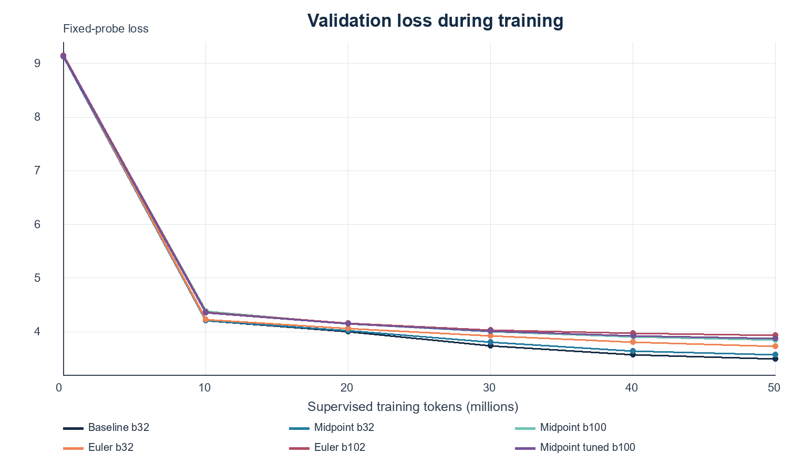
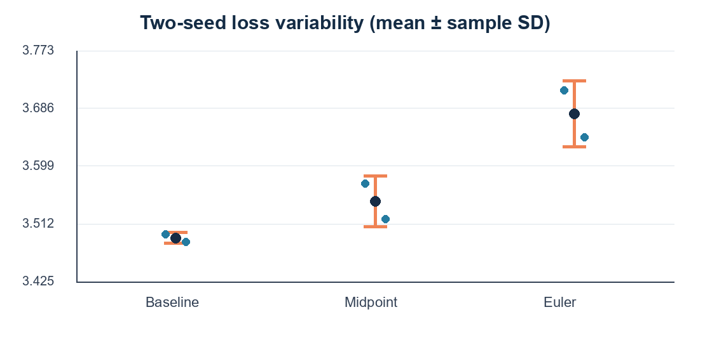

# Assignment 13: Reversible Training for a 20M LLM

## Result

A 20,166,912-parameter decoder-only language model was trained from scratch for
50 million supervised tokens. I compared normal residual training with two
reversible variants: midpoint and symplectic Euler.

**Midpoint was the best reversible variant.** At batch 32, it reduced peak
allocated memory from 3.93 GiB to 1.89 GiB, a 52% saving. This increased the
maximum measured batch from 54 to 100. The trade-off was lower training speed
because the backward pass had to reconstruct discarded activations.

## Main runs

| Run | Batch | Updates | Final loss | Perplexity | Tokens/s | Peak memory | Train time |
| --- | ---: | ---: | ---: | ---: | ---: | ---: | ---: |
| Baseline | 32 | 3,277 | **3.4963** | **32.99** | **62,173** | 3.93 GiB | 13.40 min |
| Midpoint reversible | 32 | 3,277 | 3.5726 | 35.61 | 44,660 | **1.89 GiB** | 18.66 min |
| Euler reversible | 32 | 3,277 | 3.7126 | 40.96 | 46,786 | **1.89 GiB** | 17.81 min |
| Midpoint maximum batch | 100 | 1,049 | 3.8140 | 45.33 | 49,444 | 5.36 GiB | 16.85 min |
| Euler maximum batch | 102 | 1,029 | 3.8980 | 49.30 | 48,131 | 5.46 GiB | 17.31 min |

Every run used exactly 50 million supervised targets. Final loss was measured on
the same held-out set of 5,049,456 targets. Peak memory is PyTorch peak allocated
CUDA memory during training.

## What reversibility changed

| Variant | Batch-32 memory | Memory saved | Maximum batch | Capacity vs baseline | Speed vs baseline |
| --- | ---: | ---: | ---: | ---: | ---: |
| Baseline | 3.93 GiB | - | 54 | 1.00x | - |
| Midpoint | 1.89 GiB | 2.04 GiB / 52.0% | 100 | 1.85x | 28.2% slower |
| Euler | 1.89 GiB | 2.05 GiB / 52.0% | 102 | 1.89x | 24.7% slower |

Normal training stores intermediate layer activations for backward. The
reversible models keep the final two-stream state and reconstruct earlier states
one layer at a time during backward. This removes most depth-dependent activation
storage, but adds recomputation.

Reversibility did not remove all memory use. Parameters, gradients, optimizer
state, logits, masks, the final reversible state, and the active layer workspace
still remained in memory.

## Variants tested

| Variant | What it does | Why it was included | Outcome |
| --- | --- | --- | --- |
| Baseline | Standard single-stream residual blocks | Reference for loss, speed, and memory | Fastest and lowest loss |
| Midpoint | Two-stream reversible update that reconstructs the previous state by reversing its addition | Candidate selected by the lower equal-budget pilot loss | Best reversible result |
| Symplectic Euler | Two coupled reversible attention/MLP updates, undone in reverse order | Second reversible construction from the assignment material | Same memory saving, slightly faster than midpoint, but higher loss |

Both reversible variants first trained for 5 million tokens at batch 32 and
passed reconstruction and gradient audits.

| Pilot | Validation loss after 5M tokens |
| --- | ---: |
| Midpoint | **4.4456** |
| Euler | 4.4559 |

Midpoint was selected because it had the lower pilot loss. Euler was still
trained at fixed and maximum batch so that the two reversible constructions
could be compared directly.

## Training curves



The larger maximum-batch runs completed fewer optimizer updates at the same
50M-token budget. Their higher final loss should therefore not be interpreted as
a pure cost of reversibility. The batch-32 rows are the controlled comparison.

## Second-seed check



| Variant | Seed 1 | Seed 2 | Mean | Sample SD |
| --- | ---: | ---: | ---: | ---: |
| Baseline | 3.4963 | 3.4849 | 3.4906 | 0.0081 |
| Midpoint | 3.5726 | 3.5189 | 3.5458 | 0.0379 |
| Euler | 3.7126 | 3.6422 | 3.6774 | 0.0498 |

These two-seed values are a small repeatability check, not a confidence
interval.

## Model and training setup

| Item | Value |
| --- | --- |
| Parameters | 20,166,912 |
| Architecture | 9 layers, width 384, 6 heads, MLP width 1,664 |
| Vocabulary | 8,192 |
| Context length | 512 |
| Training budget | 50,000,000 supervised targets per full run |
| Validation | 5,049,456 held-out targets |
| Fixed batch | 32 |
| Optimizer | AdamW, peak LR 6e-4, cosine decay |
| GPU | NVIDIA RTX 3070 Laptop GPU, 8 GiB |
| Memory budget | 90% CUDA allocator limit, approximately 7.2 GiB |
| Dropout / checkpointing / offload | Disabled |

The model saw 2.48 training tokens per parameter. This was enough for the systems
comparison, but not enough to produce a capable language model. Generated text
was repetitive and often incoherent.

## Precision

The final runs used BF16 matrix operations, FP32 parameters, normalization,
loss and Adam state, plus FP64 reversible residual streams.

| Matrix precision | 20-step screen | Peak memory | Result |
| --- | ---: | ---: | --- |
| BF16 | **42,947 tokens/s** | 1.36 GiB | Fastest stable choice |
| FP16 | 41,078 tokens/s | 1.36 GiB | Passed only with initial loss scale 1,024 |
| FP32 | 18,369 tokens/s | 1.36 GiB | Stable but much slower |
| FP8 | - | - | Native matrix multiplication unavailable on this GPU |

The precision screen used a repeated real batch for speed and stability. It was
not used as a model-quality comparison.

## Time and cost

| Item | Result | Notes |
| --- | ---: | --- |
| Original five controlled runs | 1.40 GPU-hours | Sum of measured training time |
| Verified full-run evidence package | 2.90 GPU-hours | Includes additional seed and tuned run |
| Learning-rate pilots | 0.32 GPU-hours | Twelve 5M-token screens |
| Total wall time including pilots | 3.33 hours | Includes validation and checkpoints |
| Estimated laptop energy | 0.53 kWh | Assumes 160 W whole-laptop power |
| Estimated local electricity | INR 4.26 | Assumes INR 8/kWh |
| Illustrative T4 GPU-only cost | USD 1.17 | Assumes USD 0.35/hour; VM resources excluded |

The energy and cloud figures are estimates, not billing records. A T4 would also
have a different runtime and does not reproduce the selected BF16 policy.

## Dataset

The repository copy contains the minimal training-ready dataset under `data/`
using Git LFS:

```text
data/
  Corpus_20M_v1/
    packed_dataset.py
    packed_50m_ctx512/
    baseline/artifacts/tokenizer_v2/tokenizer.json
  Run_20M_50M_v1/
    validation/
```

This is approximately 402 MiB and contains the exact packed training arrays,
tokenizer, and validation arrays used by the experiment. Large model checkpoints
are not included.

## Reproduce

The easiest path is the checkpoint-aware Colab notebook:

- [`Reversibility_20M_50M_Colab.ipynb`](Reversibility_20M_50M_Colab.ipynb)
- [`COLAB_README.md`](COLAB_README.md)

The notebook:

1. Clones the repository and pulls the Git LFS dataset.
2. Copies code and data into a persistent Google Drive workspace.
3. Checks CUDA, BF16 support, data files, reconstruction, and gradients.
4. Runs equal midpoint/Euler pilots and selects the better variant.
5. Searches maximum batch again on the assigned GPU.
6. Trains the baseline, reversible fixed-batch, and reversible maximum-batch
   runs for 50 million tokens.
7. Prints the final loss, speed, memory, and time table.

For a local run:

```powershell
git lfs install
git lfs pull
python -m pip install -r requirements.txt
python -B .\test_precise.py
python -B .\run_precise_suite.py
```

Maximum batch is hardware-specific. The notebook measures it again rather than
assuming that batches 100 or 102 will fit another GPU.

## Files

| File | Purpose |
| --- | --- |
| [`Reversibility_20M_50M_Colab.ipynb`](Reversibility_20M_50M_Colab.ipynb) | Colab reproduction |
| [`REPORT.pdf`](REPORT.pdf) | Full formatted report |
| [`REPORT.md`](REPORT.md) | Detailed methods, audits, tuning, and limitations |
| [`results_summary.json`](results_summary.json) | Machine-readable main results |
| [`verification_extended.json`](verification_extended.json) | Checkpoint and numerical verification |
| `model_precise.py` | Baseline and reversible model implementation |
| `experiment_precise.py` | Training, benchmarking, evaluation, and audit runner |
| `run_precise_suite.py` | Restartable experiment orchestration |
| `test_precise.py` | Correctness tests |

## Limitations

- Results come from one laptop GPU and one model/data configuration.
- The fixed-batch comparison has two seeds; broader statistical claims require
  more runs.
- The model was trained for only 2.48 tokens per parameter.
- Maximum-batch runs change the number of optimizer updates and are primarily a
  capacity demonstration.
- Energy and cloud costs are estimated scenarios.
