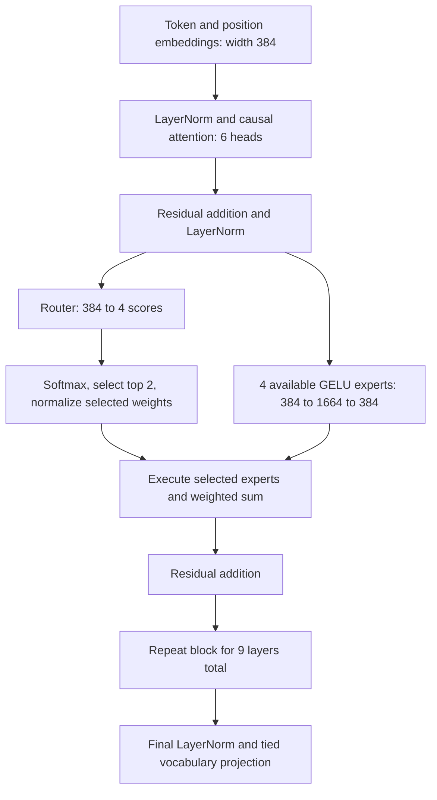
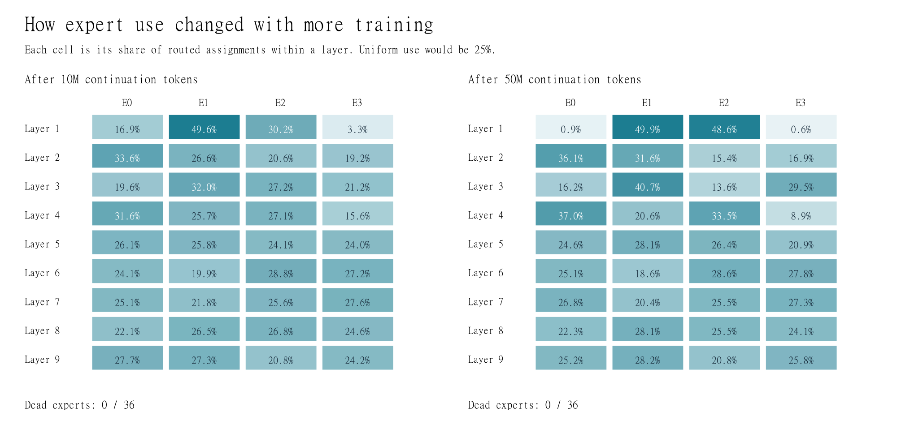

# Assignment 14: Dense-to-MoE Upcycling

[](https://colab.research.google.com/github/udisinghania/ERAv5/blob/main/Week%2014/Session_14_MoE.ipynb)

A **20,166,912-parameter dense language model** was trained for 50 million supervised targets, converted to a sparse mixture of experts, and trained for another 50 million targets. Its held-out loss fell from **3.514192 to 3.017127 nats** after conversion and continued training. A dense control trained on the same continuation targets reached **3.077944**.

The assignment asks to train a “Linear model,” convert it to an MoE, and demonstrate continued training with reduced loss (Session 14, p. 52). This submission interprets “Linear” as the dense Transformer discussed in the upcycling lesson. The model includes nonlinear GELU feed-forward networks; it is not a literal linear regression model.

## Main results

| Stage | Supervised training targets in this stage | Dense loss | MoE loss | MoE perplexity |
|---|---:|---:|---:|---:|
| Dense initialization | 0 | 9.118244 | — | — |
| Dense pretraining | 50,000,000 | 3.514192 | — | — |
| Immediately after conversion | 0 | 3.514191 | 3.514189 | 33.59 |
| First continuation | 10,000,000 per arm | 3.427297 | 3.417105 | 30.48 |
| Remaining continuation | 40,000,000 per arm | 3.077944 | **3.017127** | **20.43** |

Loss is task cross-entropy on the same **5,049,456 held-out targets**, excluding the balancing penalty. The tiny pretraining/conversion difference comes from numerical evaluation, not learning. FP32 conversion logits matched within **0.000020981** (tolerance 0.0002).


The 10M and 40M stages together consume one complete second pass over the original 50M-target corpus. That is **100M training exposures per arm including shared pretraining**, not 100M unique targets. The paired continuation uses identical targets in identical order. A split sequence at the stage boundary contributes 437 targets in stage 1 and its remaining 74 in stage 2, with no repeated targets.

## Architecture: all the important numbers

| Component | Dense | MoE |
|---|---:|---:|
| Transformer layers | 9 | 9, all containing MoE |
| Vocabulary / maximum context | 8,192 / 512 | 8,192 / 512 |
| Hidden width | 384 | 384 |
| Query / key-value heads | 6 / 6 | 6 / 6 |
| Head dimension | 64 | 64 |
| FFN / expert dimensions | 384 → 1,664 → 384 | 384 → 1,664 → 384 |
| Routed experts per layer | — | 4 |
| Routed experts across model | — | 36 |
| Selected per token per layer | 1 dense FFN | 2 of 4 (top-2) |
| Selected expert applications across 9 layers | — | 18 |
| Shared experts | — | 0 |
| Parameters per expert | 1,277,952 per FFN | 1,277,952 |
| Router shape / parameters per layer | — | 384 → 4 / 1,536 |
| Router parameters across model | — | 13,824 |
| Total parameters | 20,166,912 | **54,685,440** |
| Active parameters per token | 20,166,912 | **31,682,304** |
| Inactive parameters per token | 0 | **23,003,136** |
| Total expert-bank parameters | — | 46,006,272 |
| Common parameters including routers | — | 8,679,168 |
| Expert parallelism | No | No; all experts on one GPU |

All nine layers have the same four-expert/top-two design. Each expert contains two bias-free matrices and a GELU nonlinearity: `down(GELU(up(x)))`. The model uses pre-LayerNorm, segmented causal multi-head attention, learned position embeddings, and tied token/output embeddings. It has no shared experts, grouped-query attention, RoPE, dropout, token dropping, capacity cap, or KV-cache implementation.

“Active” is a theoretical weight count including the whole tied embedding table; it is not a measured FLOP count. Unselected experts are skipped **for that token**, but remain in GPU memory. Other tokens may select them in the same batch. Selected experts receive task gradients; routers learn selection/weighting through differentiable scores and the balancing objective. Experts have no assigned “math” or “code” jobs. Routing differences do not by themselves prove semantic expertise.



The dense FFN in each layer is copied four times. Initially all copies calculate the same function, so any two outputs averaged with weights summing to one reproduce the dense FFN. Routing then sends different tokens to different copies during training, allowing the experts to diverge. All 36 expert weight sets changed during continuation.

## What we learned by challenging the design

| Question | Evidence and answer |
|---|---|
| Does conversion alone improve loss? | No. Initial logits are almost identical; improvement follows training. |
| Is the gain just more training? | More training helps both models. The token-matched dense control reaches 3.077944 versus MoE 3.017127. |
| Is MoE better at the same compute? | Untested. MoE has more active parameters and takes longer. |
| Does the learned router matter? | With final weights fixed, random top-2 routing raises mean loss to 3.465751. |
| Do learned mixture weights matter? | Keeping learned expert choices but using equal weights raises loss to 3.103750. |
| Did the auxiliary loss balance the experts? | Not fully. Layer 1's two busiest experts take 98.49% of assignments. |
| Are experts proven semantic specialists? | No. Weight changes and source-dependent routing are insufficient to establish that. |
| Did lower loss produce fluent language? | No. All six fixed greedy prompts remained repetitive or incoherent. |

The random-routing mean uses three **inference** seeds (17, 29, 43), not three independently trained models. These ablations test sensitivity of the trained checkpoint, not the quality of separately trained alternative routers.



All 36 experts receive at least one assignment across full validation. This does not imply balanced training: layer 1's top-two assignment share increases from 79.83% to 98.49%.

## Training, hardware and cost

| Setting | Value |
|---|---|
| GPU | NVIDIA RTX 3070 Laptop, 8 GiB |
| Reference environment | Python 3.12.5, PyTorch 2.5.1+cu121, NumPy 1.26.4, tokenizers 0.20.3 |
| Batch | 32 sequences; continuation microbatch 16, accumulation 2 |
| Precision | BF16 matrix operations; FP32 parameters, AdamW state and router |
| Optimizer | AdamW, betas (0.9, 0.95), epsilon 1e-8 |
| Weight decay / gradient clipping | 0.1 on matrices, 0 on norms / norm limit 1.0 |
| Dense pretraining | 3,277 updates; peak LR 6e-4, minimum 6e-5, 2% warmup |
| First 10M continuation | 656 updates; fresh optimizer, 30-update warmup to 1e-4, cosine to 1e-5 |
| Remaining 40M continuation | 2,622 updates; preserve each arm's optimizer; 50-update warmup toward 2e-4, cosine to 2e-5 |
| Balance objective | Per-layer `4 × sum(assignment_fraction × mean_router_probability)`, averaged across layers; coefficient 0.001 |
| Balance scope | Valid non-padding tokens within each microbatch |
| Seeds | Dense pretraining 20260919; continuation order/model seed 20260926 |

| Final 40M extension | Recorded time | Average target tokens/s | Peak allocated GPU memory |
|---|---:|---:|---:|
| Dense | 11.59 min | 57,520 | 2.19 GiB |
| MoE | 18.77 min | 35,522 | 3.99 GiB |

Throughput here is 40M divided by recorded elapsed time, including periodic evaluation and saving. It excludes setup, separate router diagnostics, interruption downtime and discarded uncommitted work. Memory is PyTorch allocated memory, not total device use. The MoE resumed from its verified update-1,500 checkpoint; recovery records are retained with the evidence.

## Reproduce or inspect

The exact dataset, tokenizer, pretrained dense checkpoint and two final checkpoints are included via Git LFS. There is no dependency on a sibling Week 13 checkout. Use the notebook above or [SETUP.md](SETUP.md).

```powershell
git lfs install
git clone https://github.com/udisinghania/ERAv5.git
Set-Location 'ERAv5/Week 14'
git lfs pull --include='Week 14/**/*.bin,Week 14/**/*.pt'
python -m venv .venv
.\.venv\Scripts\Activate.ps1
python -m pip install torch==2.5.1 --index-url https://download.pytorch.org/whl/cu121
python -m pip install -r requirements.txt
python run.py verify
python run.py summary
python run.py tests
python run.py check
```

Full held-out reevaluation requires a CUDA GPU supporting BF16:

```powershell
python run.py evaluate --kind moe
python run.py evaluate --kind dense
python run.py evaluate --kind pretrained
```

CPU checkpoint loading, tokenizer parity and forward checks are also supported. Full training starts with `python run.py train --phase stage1 --action prepare`; see the complete commands in [SETUP.md](SETUP.md). Fresh outputs go to `runs/`, which Git ignores. The historical results are read-only. A new training run is not guaranteed bitwise identical across devices or library versions.

## Submission contents

- [Notebook](Session_14_MoE.ipynb): fresh-clone setup, saved local review outputs, model checks, full evaluation and optional retraining.
- [Printable report](REPORT.pdf): results, architecture, controls, limitations and reproduction.
- [Detailed measured report](evidence/stage2/REPORT.md) and [all generated examples](evidence/stage2/GENERATIONS.md).
- [Full architecture inventory](study/ARCHITECTURE.md), [lesson study guide](study/SESSION_STUDY_GUIDE.md), and [33 challenges with answers](study/CHALLENGE_THE_LESSON.md).
- [Dense pretraining result](evidence/pretraining/result.json), [conversion test](evidence/stage1/conversion_check.json), and [routing ablations](evidence/stage2/diagnostics/summary.json).
- [Data provenance](DATA.md), [source adaptation record](source_adaptations.json), [packaging validation](PACKAGING_VALIDATION.json), and [file hashes](MANIFEST.json).

The study guides reference the supplied lesson; the course PDF itself is not needed to execute this repository. Historical code/configuration snapshots preserve their original machine paths as provenance. The supported portable entry point is `run.py`; direct execution of historical evidence scripts is not the reproduction workflow.

## Limits of the conclusion

This is one training seed per architecture, using validation already inspected during development. It establishes successful dense-to-MoE upcycling and continued learning on this dataset. It does not establish equal-compute superiority, statistical significance across training seeds, semantic expert roles, fluent generation, or benefits of expert parallelism. Optimizer-resume checkpoints from the original runs are retained locally; only the three final weight checkpoints are published. Retraining regenerates optimizer state and intermediate checkpoints.
