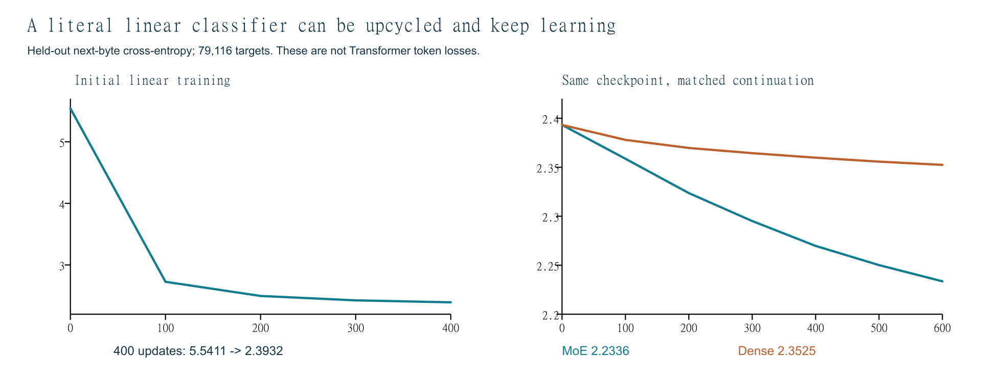
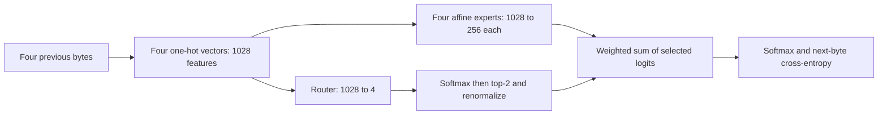
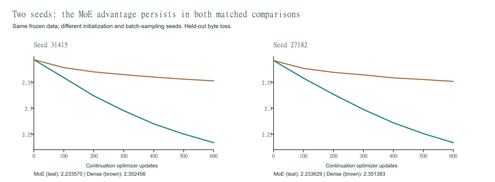
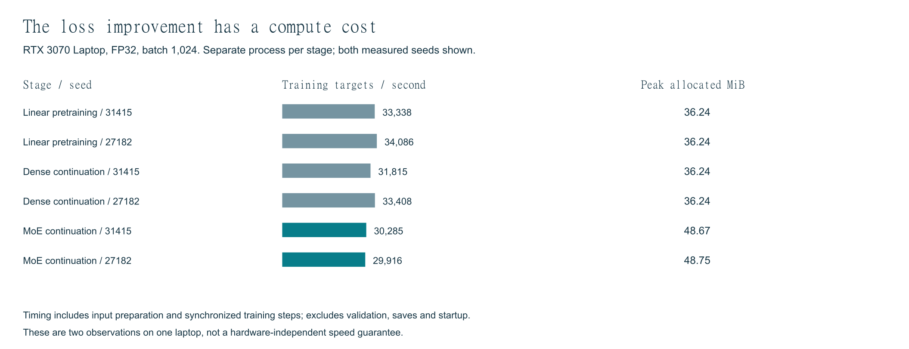
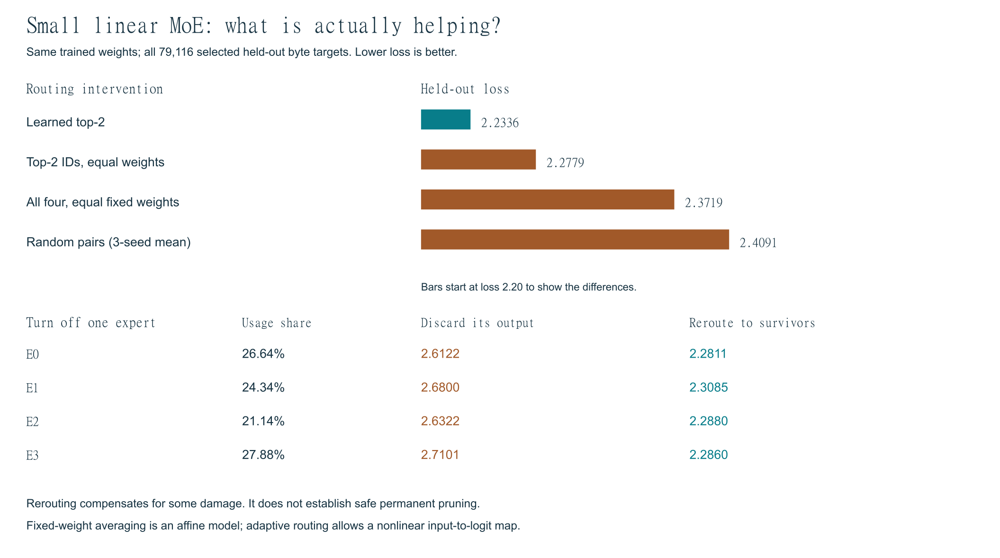
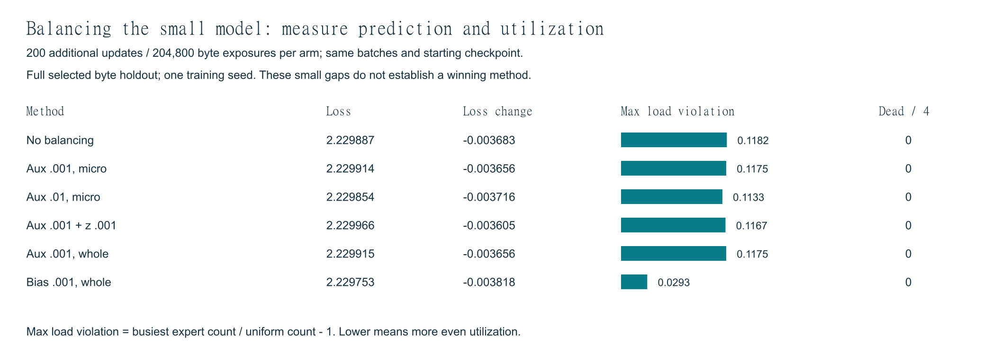

# Assignment 14: Train a Linear Model and Convert It to MoE

[](https://colab.research.google.com/github/udisinghania/ERAv5/blob/main/Week%2014/Small_Linear_MoE/Small_Linear_MoE_Colab.ipynb)

**Main result:** a trained affine next-byte predictor was copied into four experts, routed with top-2 selection, and continued training. Held-out loss decreased **5.541114 → 2.393201 → 2.233570**. A dense model given the same continuation batches reached **2.352456**. A second initialization/sampling seed confirms the direction of the result.

This is the direct linear-to-MoE assignment. The [20M Transformer extension](../README.md) remains separate; this folder runs without its code, dataset or checkpoints.

## Assignment requirements and evidence

| Requirement | What was done | Evidence |
|---|---|---|
| Train a linear model | One affine map of fixed four-byte one-hot features to 256 logits | [Model/training code](src/linear_assignment.py), [training log](results/linear_console.log) |
| Convert the trained model to MoE | Copy the trained weight matrix and bias into four experts; add a router; select two | [Conversion and losses](results/linear_results.json) |
| Preserve learned behavior at conversion | Maximum logit difference 9.54e-7 on 1,024 held-out contexts | [Semantic checks](results/linear_tests.json) |
| Continue training and reduce loss | MoE: 2.393201 → 2.233570 on all 79,116 held-out byte targets | [Results](results/linear_results.json), [checkpoints](checkpoints/) |
| Verify reproducibility | Fresh training plus 22 interventions and six balancing runs reproduced locally | [Reproduction audit](REPRODUCIBILITY.md) |

## Main runs: before conversion, immediately after, and after training

| Stage | Updates in stage | Target exposures in stage | Held-out loss (nats/byte) | Byte perplexity |
|---|---:|---:|---:|---:|
| Random linear initialization | 0 | 0 | 5.541114 | 254.9618 |
| Trained linear baseline | 400 | 409,600 | 2.393201 | 10.9485 |
| Immediately after copied-expert conversion | 0 | 0 | 2.393201 | 10.9485 |
| MoE continuation | 600 | 614,400 | 2.233570 | 9.3331 |
| Matched dense continuation | 600 | 614,400 | 2.352456 | 10.5114 |

The MoE reduces loss by **0.159631 nats/byte (6.67%)** after conversion. Against the matched dense continuation, its loss is **0.118885 lower (5.05%)**. Perplexity is exp(cross-entropy); these are byte metrics and must not be compared numerically with the parent model’s BPE-token losses.



Both continuation arms start with the same trained predictor, use the same 600 batches in the same order, and receive fresh AdamW optimizers with the same learning rate. This controls data exposure and optimizer configuration, **not compute or total parameter count**. Each arm has 1,024,000 cumulative exposures including shared pretraining. Sampling is with replacement from a fixed 1M-position training subset; repeated exposure is not new unique data.

Reported loss is validation task cross-entropy, excluding the auxiliary training penalty. Conversion changes neither the training data nor the evaluation set.

## Architecture and parameter accounting



| Component | Exact design / number |
|---|---|
| Input | Four preceding bytes; 256 byte values plus padding ID 256 at each position |
| Feature width / output classes | 4 × 257 = **1,028** / **256** |
| Original dense model | `nn.Linear(1028, 256)`, including output bias |
| Dense parameters / parameters per expert | 1,028 × 256 + 256 = **263,424** |
| MoE stages / experts per stage / total experts | **1 / 4 / 4** |
| Selected experts per example | **2**, with no token dropping or capacity limit |
| Router | `Linear(1028, 4, bias=False)`; **4,112** parameters; Normal(0, 0.01) initialization |
| Total expert-bank parameters | 4 × 263,424 = **1,053,696** |
| Total MoE parameters | 1,053,696 + 4,112 = **1,057,808** |
| Active parameters per example | 2 × 263,424 + 4,112 = **530,960** |
| Inactive expert parameters per example | 2 × 263,424 = **526,848** |
| Shared experts / expert parallelism | **0 / none**; all experts on one GPU |
| Attention, learned embeddings, hidden layers, GELU | None |

An expert computes a score for each candidate next byte by adding four position-specific input-byte contributions and an output bias. Experts have the same architecture but independent learned weights. They are not assigned human labels such as “code expert” or “math expert.”

The baseline **logits** are affine in fixed features; its output probabilities use nonlinear softmax. Input-dependent routing allows the MoE’s logits to be nonlinear. With fixed mixture weights across examples, a mixture of these affine experts collapses to one affine map. That identity is tested.

“Inactive” means not selected for one example, not permanently frozen: other examples can select that expert, and optimizer state/weight decay may move parameters with zero current task gradient. All weights remain in GPU memory. Active counts are expert-block accounting, not a FLOP or memory benchmark.

## Training setup

| Setting | Linear pretraining | Dense / MoE continuation |
|---|---|---|
| Updates / batch size | 400 / 1,024 | 600 / 1,024 |
| Learning rate | Fixed **0.01** | Fixed **0.003** |
| Optimizer | AdamW | Fresh AdamW per arm; no inherited moments |
| Betas / epsilon / weight decay | (0.9, 0.999) / 1e-8 / 0.01 | Same |
| Gradient clipping | Global norm 1.0 | Same |
| Task objective | Mean next-byte cross-entropy | Same |
| Additional MoE objective | None | **0.001 × load-balancing auxiliary loss** |
| Evaluation interval | Every 100 updates plus initialization | Same |
| Initialization/sampling seed | **31415**; second run **27182** | Matched within each seed |
| Precision | FP32 parameters and operations; TF32 disabled | Same |
| Hardware | RTX 3070 Laptop GPU, 8 GiB | Same; no expert parallelism |
| Tested environment | Python 3.12.5, torch 2.5.1+cu121, NumPy 1.26.4 | Same |

The router computes softmax over four scores, keeps the two largest probabilities, and normalizes those two weights to sum to one. The training balance term is `4 × sum(f_e × mean(p_e))`, where `f_e` is a detached fraction of the **2N selected assignments** in a batch of N examples. All four probability means participate in this term. No z-loss or selection bias is used in the main run; those are separate follow-up arms.

## Second-seed check



| Stage | Seed 31415 | Seed 27182 | Mean loss | Sample SD |
|---|---:|---:|---:|---:|
| Linear pretraining | 2.393201 | 2.391488 | 2.392345 | 0.001211 |
| Dense continuation | 2.352456 | 2.351383 | 2.351919 | 0.000759 |
| MoE continuation | 2.233570 | 2.233629 | 2.233600 | 0.000042 |

Both seeds reduce loss after conversion and both MoEs outperform their matched dense continuations. This is a two-seed repeatability check, **not a confidence interval**. It changes initialization and training-batch sampling, while keeping the dataset split fixed. The six balancing methods below have only one training seed. [Raw histories and checkpoints](results/extended_study/), [study implementation](src/extended_study.py).

## Measured training speed, memory and time



| Stage | Seed | Updates | Training seconds | Targets/s | Peak allocated MiB |
|---|---:|---:|---:|---:|---:|
| Linear pretraining | 31415 | 400 | 12.29 | 33,338 | 36.24 |
| Linear pretraining | 27182 | 400 | 12.02 | 34,086 | 36.24 |
| Dense continuation | 31415 | 600 | 19.31 | 31,815 | 36.24 |
| Dense continuation | 27182 | 600 | 18.39 | 33,408 | 36.24 |
| MoE continuation | 31415 | 600 | 20.29 | 30,285 | 48.67 |
| MoE continuation | 27182 | 600 | 20.54 | 29,916 | 48.75 |

For seed 31415, the MoE continuation takes **1.05×** the measured dense-continuation training time at equal target exposure. This implementation trades extra compute and parameters for lower loss; it does not establish an equal-compute advantage.

Each stage runs in a separate process. Timing sums synchronized training-step wall time, including batch preparation, one-hot construction, CPU-to-GPU transfer, forward/backward and optimizer updates; it excludes validation, checkpoint writing and process startup. All training steps, including the first, are counted. Peak memory is the maximum PyTorch **allocated** GPU memory during training steps, including model, gradients, optimizer state and temporary tensors; it is not `nvidia-smi` usage. These are two observations on one laptop, not a speed guarantee or an optimized implementation. Power consumption and monetary cost were not measured. [Measurement protocol](results/extended_study/design.json), [raw measurements](results/extended_study/results.json).

## Dataset and provenance

The complete input is bundled in [linear_data.npz](data/linear_data.npz): **1,000,000 selected training target positions** and **79,116 held-out byte targets**, each with its preceding four-byte context. The fixed data-selection seed is 31415, separate from the second model-training seed. Bytes are 0–255; context padding is 256.

The data were derived from separate train/validation splits of the frozen corpus used in earlier assignments. Frozen tokenizer pieces were decoded to bytes, special tokens skipped, and each target byte inherited its original token loss mask. Contexts reset at document segments. Eight validation fragments were selected per source group. The source counts below were reconstructed and every context/target compared elementwise to the bundled arrays before attribution.

| Source group in this byte subset | Training byte positions | Training share | Held-out byte targets |
|---|---:|---:|---:|
| agentic | 16,170 | 1.62% | 4,151 |
| code | 180,882 | 18.09% | 7,995 |
| general | 102,993 | 10.30% | 8,989 |
| indic | 191,247 | 19.12% | 10,327 |
| long_context | 99,919 | 9.99% | 9,235 |
| reasoning | 2,989 | 0.30% | 1,986 |
| science_math | 145,270 | 14.53% | 9,774 |
| fineweb_edu | 170,255 | 17.03% | 8,395 |
| wikipedia_en | 47,772 | 4.78% | 8,108 |
| cosmopedia_v2 | 42,503 | 4.25% | 10,156 |
| **Total** | **1,000,000** | **100%** | **79,116** |

These are byte-subset counts, not the original corpus’s token proportions. The first seven rows are inherited corpus lanes; FineWeb-Edu, Wikipedia and Cosmopedia are additional source groups. Upstream source terms apply to the text; the repository code license does not relicense it. [Dataset details](DATA.md), [selected fragment indices](data/linear_data_provenance.json), [exact source attribution](data/source_mix.json), [inherited source/license records](data/provenance/baseline_source_locks.json), and acquisition records for [FineWeb-Edu](data/provenance/fineweb_edu/lock.json), [Wikipedia](data/provenance/wikipedia_en/lock.json), [Cosmopedia](data/provenance/cosmopedia_v2/lock.json).

Reproduction starts from the bundled byte subset; it does not redownload upstream datasets or reconstruct the original 50M-token corpus. The holdout receives no optimizer updates, but has been inspected during development and is **not an untouched final test set**.

## Challenge the mechanism: what actually helps?



| Intervention on the trained seed-31415 MoE | Held-out byte loss | Interpretation |
|---|---:|---|
| Learned top-2 | 2.233570 | Reference |
| Same selected experts, equal weights | 2.277916 | Learned mixture weights help |
| All four experts, fixed equal weights | 2.371851 | More expert evaluations alone do not guarantee better loss |
| Random pairs, equal weights; three routing seeds | 2.409055 | Compare with equal-weight learned pairs to isolate selection |

| Expert removed | Assignment share | Zero its output | Exclude and reroute |
|---|---:|---:|---:|
| E0 | 26.64% | 2.612155 | 2.281066 |
| E1 | 24.34% | 2.680011 | 2.308489 |
| E2 | 21.14% | 2.632155 | 2.287967 |
| E3 | 27.88% | 2.710122 | 2.285957 |

Zeroing retains the original selected weights and discards one output, changing both information and logit scale. Rerouting selects two surviving experts and renormalizes their original probabilities. Rerouting compensates for some damage; it does not prove that permanent pruning plus retraining would be harmless. Every expert is used on this holdout; zero dead experts is not a guarantee of balanced use in every batch.

| Inference top-k | Loss | Active parameters |
|---|---:|---:|
| 1 | 2.243434 | 267,536 |
| 2 | 2.233570 | 530,960 |
| 3 | 2.247976 | 794,384 |
| 4 | 2.257200 | 1,057,808 |

These change inference routing on a model trained with top-2; they do not compare separately trained top-k models. The fixed average was not retrained either. All four experts have diverged from their identical starting weights, but weight differences and usage patterns do not establish semantic specialties. At exact-copy initialization, task gradients to the normalized router cancel apart from numerical residue; expert gradients can differ across routed examples, allowing specialization to develop. [Full explanations, 22 cases, gradient measurements and routing traces](deep_dive/REPORT.md).

## Session sections 12–14: balancing experiments

All six methods start from the same final seed-31415 MoE checkpoint with fresh AdamW states and the same 200 batches: **204,800 additional exposures**, global batch 1,024, microbatch 256, fixed LR 0.0003, weight decay 0.01, clip 1.0. Evaluation uses the same full selected 79,116-byte holdout.

| Method | Final loss | Change from 2.233570 | Max load violation | Dead experts / 4 |
|---|---:|---:|---:|---:|
| No balance objective | 2.229887 | -0.003683 | 0.1182 | 0 |
| Aux .001, microbatch | 2.229914 | -0.003656 | 0.1175 | 0 |
| Aux .01, microbatch | 2.229854 | -0.003716 | 0.1133 | 0 |
| Aux .001 + z .001 | 2.229966 | -0.003605 | 0.1167 | 0 |
| Aux .001, whole batch | 2.229915 | -0.003656 | 0.1175 | 0 |
| Selection bias, gamma .001 | 2.229753 | -0.003818 | 0.0293 | 0 |



- **Section 12:** auxiliary balancing changes router gradients; z-loss penalizes the squared log-sum-exp of router logits. A stable short run does not prove a long-run stability benefit.
- **Section 13:** selection-only bias uses `p + bias` to choose experts, but original `p` for mixture weights. After an optimizer update, bias moves by `0.001 × sign(mean load − expert load)` and is centered. No explicit balance-loss gradient is added, but routing changes can still change task gradients.
- **Section 14:** microbatch counts cover 256 examples; whole-batch counts cover all four microbatches in one 1,024-example update. A detached-count prepass and weighted probability gradients reproduce the whole-batch objective; gradient parity is tested. This is one GPU, not distributed balancing.

Max load violation is `busiest expert count / uniform count − 1`; lower means more even usage. Bias balancing gives much more even usage here. All loss differences between these short arms are tiny, so this one-seed study does not establish a universally best balancing method. [Configurations](deep_dive/balance_design.json), [results](deep_dive/balancing.json), [checks](deep_dive/tests.json).

## Reproduce locally or in Colab

**Colab:** open the badge, select a GPU runtime, and Run all. The [Colab notebook](Small_Linear_MoE_Colab.ipynb) clones the small folder without LFS downloads, creates isolated Python 3.12 / torch 2.5.1 / NumPy 1.26.4 dependencies, checks CUDA and file hashes, evaluates checkpoints, runs fresh training plus the deep dive, runs the two-seed study, and archives outputs. Optional Drive persistence is controlled by a clearly labeled setting. **The notebook orchestration is tested locally; a hosted Colab GPU run is not yet independently verified.** See [Colab details and validation scope](COLAB_README.md).

**Local:** use the [pinned environment setup](SETUP.md). From this folder:

```powershell
python run.py verify
python run.py evaluate
python run.py reproduce --output runs/reproduction
python run.py study --output runs/two_seed_study
```

Use a new output folder for each training run. `verify` needs only standard Python. Other commands require CUDA. Outputs go into separate run folders; shipped reference evidence is preserved. On different hardware, `--allow-reference-drift` lets the run finish while recording **REFERENCE_DRIFT** if the 1e-4 loss tolerance is exceeded. It does not disable correctness or loss-reduction checks and does not turn a numerical mismatch into PASS.

The [review notebook](Small_Linear_MoE.ipynb) presents recorded evidence with executed inspection cells; it is distinct from the Colab training workflow.

## Verification and files

The original independent-copy run reproduced all three main losses and all 28 intervention/balancing comparison losses exactly on the tested machine. Saved balancing checkpoints reproduce their final losses after reloading. A local Git commit/clone round trip preserved every package file and checkpoint evaluation. Reproduction and fresh-seed variability are separate checks. [Audit and current validation scope](REPRODUCIBILITY.md).

| File / folder | Purpose |
|---|---|
| [run.py](run.py), [src/linear_assignment.py](src/linear_assignment.py) | Entry point, affine model, router, conversion and training |
| [src/deep_dive.py](src/deep_dive.py), [src/extended_study.py](src/extended_study.py) | Intervention/balancing and two-seed cost runners |
| [data/](data/) | Frozen input arrays, exact source attribution and provenance |
| [checkpoints/](checkpoints/) | Original trained linear, dense continuation and MoE weights |
| [results/](results/), [results/extended_study/](results/extended_study/) | Main logs, measured study histories and both seeds’ checkpoints |
| [deep_dive/REPORT.md](deep_dive/REPORT.md), [deep_dive/](deep_dive/) | Detailed reasoning, results and six balancing checkpoints |
| [validation/](validation/), [MANIFEST.json](MANIFEST.json) | Verification evidence and SHA-256 file manifest |
| [SETUP.md](SETUP.md), [COLAB_README.md](COLAB_README.md), [PUBLISH.md](PUBLISH.md) | Setup, hosted workflow and safe update commands |

Small checkpoints use ordinary Git; the local `.gitattributes` overrides the parent’s LFS checkpoint rule. No original 20M files need to be downloaded or changed.

## Limitations

- This is a four-byte-context predictor, not a capable conversational language model. Four bytes may cover fewer than four characters in UTF-8 text.
- The main comparison has two initialization/sampling seeds on one fixed data subset; the balancing study has one. Neither establishes broad statistical generality.
- Equal data exposure does not mean equal compute. The MoE stores more parameters, activates more parameters than the baseline, and is slower in the measured continuation.
- Top-k and shutdown results are inference interventions on a top-2-trained checkpoint. They do not demonstrate optimal retrained configurations or safe permanent pruning.
- One-stage linear experts cannot reproduce layer-dependent behavior or attention/residual interactions in the 20M Transformer extension. Neither implementation tests expert parallelism.
- The holdout was inspected during development. No semantic-specialist labels, large-language-model quality, energy savings or cross-hardware performance guarantees are claimed.
- Windows/CUDA was tested locally. Hosted Colab execution remains a separate validation step; a badge is not evidence that it ran on a Google GPU.
