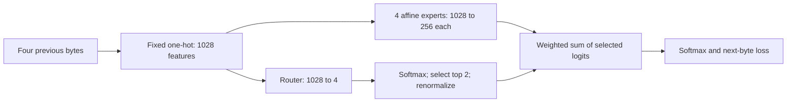

# Small linear MoE: a complete, interpretable deep dive

The 20M Transformer is the richer systems and multilayer study. This one-stage model is the clearer experiment for isolating what routing adds to a literal linear classifier. Use both, with distinct claims and loss units.

## Exact architecture

| Property | Small model | Original Transformer |
|---|---:|---:|
| Input | Four previous bytes, fixed one-hot | Up to 512 BPE tokens, learned embeddings |
| Output classes | 256 bytes | 8,192 BPE tokens |
| Dense parameters | 263,424 | 20,166,912 |
| MoE stages | 1 | 9 |
| Routed experts per stage | 4 | 4 |
| Total routed experts | 4 | 36 |
| Experts selected per input per stage | 2 | 2 |
| Expert | Affine 1,028 -> 256, with bias | 384 -> 1,664 -> 384, GELU, no biases |
| Parameters per expert | 263,424 | 1,277,952 |
| Router per stage | 1,028 -> 4, no bias; 4,112 parameters | 384 -> 4, no bias; 1,536 parameters |
| Total router parameters | 4,112 | 13,824 |
| MoE total parameters | 1,057,808 | 54,685,440 |
| Active parameters per input, expert-block convention | 530,960 | 31,682,304 |
| Inactive expert parameters per input | 526,848 | 23,003,136 |
| Shared experts | 0 | 0 |
| Expert parallelism | None; one GPU | None; one GPU |

For the small model, 4 x 257 = 1,028 input features: each of four byte positions has 256 byte values plus a padding feature. An expert has 1,028 x 256 weights + 256 biases. Active = 2 x 263,424 + 4,112. These are parameter accounting conventions, not a FLOP or memory benchmark. All four experts stay resident in GPU memory.



## What does an expert actually do?

Each expert stores a score for each output byte, for every input byte at each of four positions, plus an output bias. For output byte y, its logit is b[y] + W[y, byte at position 1] + ... + W[y, byte at position 4]. It has no hidden neurons or learned attention. The router sees the same four-position context and chooses which two predictors contribute. Experts have the same design but learn different weights; they are not assigned predefined language, math or punctuation roles.

Softmax makes classification probabilities nonlinear even in the baseline. The distinguishing property is that baseline logits are affine in the fixed features. After conversion, input-dependent expert choice and weights allow nonlinear logits. If expert weights are fixed constants across inputs, the mixture collapses algebraically to another affine layer. This identity is tested.

## Does training satisfy the assignment?

Yes: initial linear loss 5.541114 -> trained linear 2.393201 -> continued MoE 2.233570. Matched dense continuation ends at 2.352456. Conversion preserves logits within 9.54e-07.

The original Transformer validates a larger dense-to-MoE conversion; its GELU network is not a literal linear model. Do not compare its token losses directly with these byte losses.

## Challenge: is storing more experts enough?


| Intervention on original small MoE checkpoint | Byte loss |
|---|---:|
| Learned top-2 | 2.233570 |
| Top-2 IDs, equal weights | 2.277916 |
| All four, equal fixed weights | 2.371851 |
| Random pairs (3-seed mean) | 2.409055 |

Keeping the learned selections but equalizing their weights isolates the gate-weight contribution. Random pairs with equal weights are compared with learned pairs with equal weights; that comparison isolates selection better than comparing random equal-weight routing directly with the fully learned gate. Fixed equal-weight averaging uses all four trained experts, yet performs worse than learned top-2. That is evidence for this routing configuration, not a theorem that every learned router must help. The fixed mixture was not retrained or optimized as a separate dense baseline.

## Challenge: what if we shut experts down?

| Expert | Assignment share | Relative L2 change from pretrained | Zero output loss | Reroute loss | Use this expert alone |
|---|---:|---:|---:|---:|---:|
| E0 | 26.64% | 40.53% | 2.612155 | 2.281066 | 2.460092 |
| E1 | 24.34% | 37.60% | 2.680011 | 2.308489 | 2.474089 |
| E2 | 21.14% | 42.95% | 2.632155 | 2.287967 | 2.497146 |
| E3 | 27.88% | 46.94% | 2.710122 | 2.285957 | 2.520620 |

Zeroing removes the selected expert output without replacing it or renormalizing the surviving weight. This changes both information and logit scale. Rerouting excludes that expert before selecting two surviving experts and normalizes their original probabilities. It measures compensation, not permanent pruning plus recovery training. Every reroute is worse than normal on this selected holdout.

Turning all experts off gives zero logits and uniform probabilities: loss 5.545177, matching ln(256). This is almost a structural sanity check here: there is no residual prediction path. In the Transformer, attention and residual paths remain after expert-branch bypass, so that intervention asks a richer question.

## Challenge: why only top-2?

| Inference top-k | Loss | Active parameter count |
|---|---:|---:|
| 1 | 2.243434 | 267,536 |
| 2 | 2.233570 | 530,960 |
| 3 | 2.247976 | 794,384 |
| 4 | 2.257200 | 1,057,808 |

These are inference-only interventions on a model trained with top-2. They do not establish which k would win after matched retraining. More active experts did not automatically improve this checkpoint. Top-1 weights renormalize to one, so its gate-weight gradients during training would differ substantially from top-2.

## Challenge: if the experts begin identical, how can routing learn?

At exact-copy initialization, every normalized mixture has the same output. The task-loss router gradient therefore cancels mathematically, away from selection ties. Different selected subsets and weights still send different gradients to the experts, allowing them to diverge. Auxiliary balancing can move the router before task gradients become useful.

| Diagnostic on 1,024 held-out contexts | Fresh exact copies | Trained small MoE |
|---|---:|---:|
| Task-loss router gradient norm | 4.275e-09 | 0.01394 |
| Unscaled auxiliary gradient norm | 0.05989 | 0.0163 |

The initial tiny task gradient is floating-point residue. This diagnostic is from one batch, not a general gradient-conflict study. All expert pairs now have different weights. Parameter divergence is evidence of learning, not proof of human-interpretable specialization. Target-byte group usage and losses, plus sixteen actual context/routing traces, are saved in diagnostics.json. The router never receives the future target byte; groups are assigned only after prediction for analysis.

## Challenge: are inactive parameters frozen?

Inactive means not selected for that example. Another example in the same batch can select that expert. Selected expert outputs receive task gradients; all four router probabilities participate in the balance objective when enabled. Optimizer state and weight decay can also move parameters whose current task gradient is zero. All expert weights and optimizer state still consume memory; this implementation has neither expert offloading nor multi-GPU expert parallelism.

## Sections 12, 13 and 14 on the small model

Six arms each restart from the same final small MoE checkpoint with fresh matching AdamW states. Global batch 1,024, microbatch 256, 200 updates, 204,800 additional byte exposures, LR .0003, weight decay .01, gradient clipping 1. All use identical batches, FP32 with TF32 disabled, and all 79,116 selected holdout targets for evaluation.


| Method | Final byte loss | Change | Max load violation | Dead experts |
|---|---:|---:|---:|---:|
| No balancing | 2.229887 | -0.003683 | 0.118231 | 0 |
| Aux .001, micro | 2.229914 | -0.003656 | 0.117549 | 0 |
| Aux .01, micro | 2.229854 | -0.003716 | 0.113251 | 0 |
| Aux .001 + z .001 | 2.229966 | -0.003605 | 0.116740 | 0 |
| Aux .001, whole | 2.229915 | -0.003656 | 0.117549 | 0 |
| Bias .001, whole | 2.229753 | -0.003818 | 0.029274 | 0 |

Section 12: compare no balance loss, auxiliary .001, auxiliary .01, and auxiliary .001 plus z-loss .001. Section 13: update a selection bias by .001 times the sign of under/overuse; weight selected experts using original probabilities. Section 14: compare auxiliary .001 counted separately per 256-example microbatch with counts aggregated across the 1,024-example optimizer batch. Whole-batch gradient parity is tested. All arms perform the same count prepass.

These runs test short continuation of an already reasonably balanced model, not prevention of collapse from initialization. Lower load violation need not mean lower task loss. A short run without instability cannot prove that z-loss improves stability. The training seed is shared, not repeated; small differences do not justify selecting a universal winner. Each arm retains weights, selection-bias state, learning history, per-update counts, gradients and losses. Reloaded checkpoints reproduce final evaluation losses.

## Which deep dive is better?

| Learning question | Better experiment | Why |
|---|---|---|
| Does a literal linear predictor convert and continue learning? | Small | Directly meets the wording; easier to reproduce and inspect |
| What do expert selection and mixture weights contribute? | Small | One stage and direct affine-expert interpretation |
| Do experts specialize differently by depth? | 20M Transformer | Nine layers; rich contextual hidden states |
| How do MoE, attention and residual paths interact? | 20M Transformer | Those paths do not exist in the small model |
| What is the measured parameter/throughput/memory tradeoff? | Existing Transformer study | It already has recorded dense/MoE GPU benchmarks; no matched new small-model benchmark is claimed |
| Does expert parallelism scale across GPUs? | Neither | Both use one GPU; neither tests distributed dispatch |
| Can we learn the balancing mechanisms? | Both | Small is easier to isolate; Transformer checks the mechanisms in a deeper setting |

Recommendation: submit the small linear experiment first as the direct assignment demonstration, and retain the Transformer as the deeper extension. A single-stage model cannot reproduce multilayer behavior merely by repeating the same plots.

## Reproduce and inspect

This is an independent package. It needs no Transformer code, tokenizer, Week 13 folder or external dataset download. Run from the package root:

```powershell
python run.py verify
python run.py evaluate
python run.py reproduce --output runs/reproduction
```

The reproduction command trains a fresh baseline, continues matched dense and MoE arms, evaluates their checkpoints, reruns semantic checks, and runs all 22 deep-dive interventions and six balancing arms from the freshly trained MoE. Outputs go under runs/reproduction; shipped evidence is preserved. See ../SETUP.md and ../REPRODUCIBILITY.md for tested versions and limitations.

Raw evidence in this directory includes diagnostics.json, balancing.json, balance_design.json, tests.json, verification.json, per-arm histories and six checkpoints. Checkpoints include selection-bias state. Data and source provenance are in ../data. All scores use the selected 79,116-byte holdout, not the complete Transformer token holdout.
