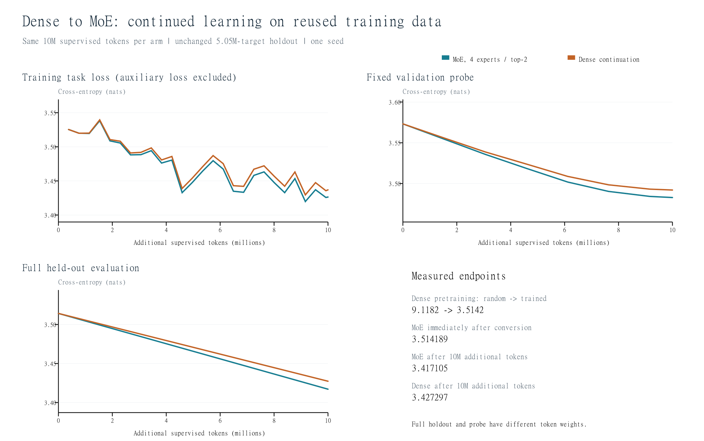
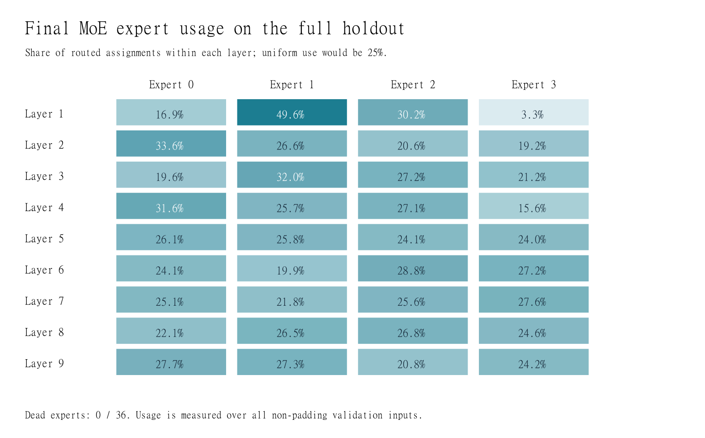

# Session 14 assignment: measured results

**The converted MoE continued learning: full held-out loss decreased from 3.514189 to 3.417105 nats after 10 million additional supervised tokens.**

The starting checkpoint was the previously trained 20.17M-parameter dense Transformer. Its trained FFNs were copied into four experts per layer; a new router selected two for each token. All original data and environment files were used read-only.

| Stage | Training exposure | Full validation loss | Perplexity |
|---|---|---:|---:|
| Dense, before original training | 0 | 9.118244 | 9120.17 |
| Dense, after original training | 50M tokens | 3.514192 | 33.59 |
| MoE, immediately after conversion | Same pretrained weights | 3.514189 | 33.59 |
| MoE, after continuation | 50M original + 10M reused | 3.417105 | 30.48 |
| Dense control, after continuation | 50M original + same 10M reused | 3.427297 | 30.79 |

Historical dense pretraining measurements are inherited from the verified prior run. Conversion, continuation, and both new endpoint evaluations were measured in this experiment. All full evaluations use the same 5,049,456 held-out supervised targets.

## What the comparison establishes

The MoE reduced held-out cross-entropy by 0.097084 nats (2.76%). The MoE finished 0.010192 nats lower than the dense continuation. This is one run per arm; the small difference is descriptive, not a statistically established architectural advantage. The MoE also uses more active weights, so this is an equal-token comparison, not an equal-compute comparison.

## Conversion and training details

- Dense: 20,166,912 parameters. MoE: 54,685,440 total and 31,682,304 active per token, counting the full tied embedding table.
- Nine layers, four routed experts per layer, top-2, no shared expert, no token dropping. Each expert initially copies the complete trained 384 -> 1,664 -> 384 GELU FFN.
- Before training, the largest full-FP32 dense/MoE logit difference was 0.000020981; the function-preservation check passed with tolerance 0.0002.
- Fresh AdamW state for both continuations, effective batch 32, peak LR 0.0001, 30 warmup updates, decay to 0.00001, and gradient clipping at 1.0.
- Auxiliary balancing coefficient 0.001, with load measured over each microbatch. Plotted task loss excludes this auxiliary term.
- Existing 50M-token corpus, frozen tokenizer, sequence length 512, original document-isolation masks, reset positions, and response-only target masks preserved.
- Exactly 10,000,000 additional supervised targets in each arm, using the identical seeded sequence order. These are reused training data. Held-out data never enter updates.

## Routing and verification

All 36 experts updated and diverged from their identical initial copies. The full final validation pass found **0 dead experts**. Unequal utilization remains visible below; zero dead experts does not imply perfectly balanced routing.

The post-training audit status is **PASS**. It checks input hashes, unchanged source files, exact token accounting, checkpoint hashes, finite weights, full held-out token counts, loss reduction, and expert updates. Four semantic tests cover conversion and gradients, causal/document isolation and masking, sparse routing, and optimizer restoration.

## Per-source full validation

| Source | Before conversion (dense re-evaluation) | Final MoE | Final dense |
|---|---:|---:|---:|
| agentic-validation-v2 | 3.3882 | 3.2857 | 3.2970 |
| code-validation-v2 | 3.9366 | 3.8092 | 3.8204 |
| general-validation-v2 | 3.6448 | 3.5640 | 3.5727 |
| indic-validation-v2 | 2.7474 | 2.6517 | 2.6644 |
| long_context-validation-v2 | 3.6089 | 3.5149 | 3.5244 |
| reasoning-validation-v2 | 3.0872 | 2.9656 | 2.9818 |
| science_math-validation-v2 | 3.7006 | 3.6209 | 3.6290 |
| fineweb_edu-validation | 3.5248 | 3.4530 | 3.4606 |
| wikipedia_en-validation | 3.6171 | 3.5326 | 3.5413 |
| cosmopedia_v2-validation | 3.5621 | 3.4699 | 3.4794 |

## Local GPU measurements

| Run | Updates | Recorded run time | Peak allocated GPU memory |
|---|---:|---:|---:|
| MoE | 656 | 4.31 min | 3.97 GiB |
| Dense control | 656 | 2.55 min | 2.19 GiB |

Measured on the RTX 3070 Laptop GPU. Recorded run time includes periodic probes, checkpointing, and final validation, but excludes initial validation and setup. Memory is PyTorch peak allocation, not total system/display GPU use.

## Artifacts

- `moe/final.pt`: trained MoE checkpoint; `moe/best.pt`: checkpoint selected by the fixed validation probe.
- `dense/final.pt`: dense continuation control.
- `moe/events.jsonl` and `dense/events.jsonl`: task-loss and validation history.
- `data_plan.json`: upstream hashes and exact data-reuse plan.
- `verification.json`, `test_results.json`, `conversion_check.json`: recorded checks.
- `README.md`: architecture, local environment, reproduction and resume commands.

## Limits

The assignment is interpreted as dense-model upcycling. The original wording "Linear model" is ambiguous; this experiment uses a nonlinear dense Transformer. The model remains small and lightly trained. Lower loss does not establish conversational quality, factual accuracy, reasoning ability, or a general speed/quality advantage for MoE. The sparse Python implementation targets a single consumer GPU, not distributed training or optimized MoE kernels.
