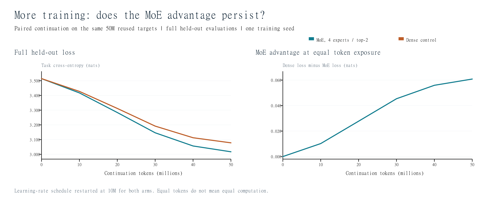

# Session 14: extended experiment findings

**MoE held-out loss reached 3.017127 nats**, compared with 3.417105 after the first 10M-token continuation and 3.514192 before conversion. The dense control reached 3.077944 on exactly the same continued training data.

## Findings

1. **More training helped.** The extra 40M targets reduced MoE held-out loss by 0.399978 nats. Relative to the original dense checkpoint, loss fell 14.14% and perplexity fell from 33.59 to 20.43.
2. **The paired architecture comparison:** dense loss minus MoE loss is 0.060817 nats after 50M continuation targets, versus 0.010192 after 10M. Positive values favor the MoE. The MoE has lower loss on 10 of the 10 held-out source groups. This is a descriptive result for one training seed, not proof of general superiority.
3. **Routing sensitivity:** random expert selection has mean loss 3.465751 across three inference seeds, +0.448624 nats relative to normal routing. Uniform weights over the learned choices give 3.103750, a change of +0.086623. The table below reports every control.
4. **Loss improved while the first layer became more concentrated.** Its two busiest experts take 98.49% of assignments, up from 79.83% after the first 10M tokens. Zero completely unused experts therefore coexists with substantial underuse of two experts in this layer.
5. **Generation quality remains weak.** Both final models produced repetitive continuations on all six fixed greedy-decoding prompts. The loss improvement has not yet translated into fluent text in these examples. Every output is retained in `GENERATIONS.md`.

## Full held-out progression

| Continuation targets (millions) | MoE loss | Dense loss | Dense minus MoE |
|---:|---:|---:|---:|
| 0.000 | 3.514189 | 3.514191 | +0.000002 |
| 10.000 | 3.417105 | 3.427297 | +0.010192 |
| 20.013 | 3.283708 | 3.311477 | +0.027769 |
| 30.011 | 3.146096 | 3.191476 | +0.045380 |
| 40.012 | 3.056566 | 3.112488 | +0.055922 |
| 50.000 | 3.017127 | 3.077944 | +0.060817 |

All full evaluations use the same 5,049,456 held-out supervised targets. Intermediate milestones occur at optimizer-step boundaries, so the table gives actual counts. The small fixed training-time probe is separate and is not mixed into this table.

## What was changed

The earlier experiment stopped after 10M continuation targets. This extension resumed each matching model and AdamW state for the remaining 40M targets of the same seeded corpus permutation. A new common learning-rate schedule warmed up to 0.0002 and decayed to 0.00002. No architecture, tokenizer, context length, auxiliary-loss coefficient, or data mixture was changed.

Together the two stages consume exactly one full 50M-target continuation pass. Those targets were already used during the original 50M dense pretraining. Total exposure is therefore 100M targets per arm, drawn from the same existing 50M-target corpus. This is more optimization on reused training data, not a larger unique dataset.

The MoE has 54.69M total / 31.68M active parameters versus 20.17M for the dense model. The comparison matches token exposure and optimization settings, not FLOPs, model capacity, or elapsed time.

## Routing ablations: same final weights

| Policy | Full held-out loss | Perplexity | Difference from learned |
|---|---:|---:|---:|
| Learned top-2 and learned weights | 3.017127 | 20.43 | +0.000000 |
| Learned top-2, uniform 1/2 weights | 3.103750 | 22.28 | +0.086623 |
| Random top-2, uniform 1/2 weights (seed 17) | 3.466042 | 32.01 | +0.448915 |
| Random top-2, uniform 1/2 weights (seed 29) | 3.465582 | 32.00 | +0.448455 |
| Random top-2, uniform 1/2 weights (seed 43) | 3.465628 | 32.00 | +0.448501 |

The random-control mean is 3.465751 nats; its sample standard deviation across the three routing seeds is 0.000253. These seeds describe randomness during inference, not uncertainty across independently trained models. Every policy still executes two experts per non-padding token.

Random selection worsens this model, showing that the learned expert assignments matter after continued training. This does not establish that a model trained from the beginning with random routing would have the same deficit.

Replacing learned mixture weights with equal weights also worsens loss. Both selection and weighting therefore affect the final result in these inference controls.

## Expert utilization

The final full validation pass has **0 unused experts out of 36**. Load remains uneven. The comparison below shows how the allocation changed between the two checkpoints; uniform loading would be 25% per expert.

The first layer is the strongest imbalance: two experts account for 98.49% of its assignments. This concentration also matters when interpreting random routing: the intervention can send inputs to experts that received comparatively few training updates. A random-routing penalty alone does not prove semantic specialization.

Per-source, per-layer counts are available in `diagnostics/learned.json`. Differences between source groups are descriptive routing patterns and do not, by themselves, demonstrate topic or language expertise.

## Per-source held-out results

| Source | Original dense | MoE after 10M | MoE after 50M | Dense after 50M | Dense minus MoE |
|---|---:|---:|---:|---:|---:|
| agentic-validation-v2 | 3.3882 | 3.2857 | 2.8111 | 2.8777 | +0.0666 |
| code-validation-v2 | 3.9366 | 3.8092 | 3.3001 | 3.3570 | +0.0570 |
| general-validation-v2 | 3.6448 | 3.5640 | 3.2057 | 3.2654 | +0.0597 |
| indic-validation-v2 | 2.7474 | 2.6517 | 2.2648 | 2.3423 | +0.0775 |
| long_context-validation-v2 | 3.6089 | 3.5149 | 3.1525 | 3.2108 | +0.0583 |
| reasoning-validation-v2 | 3.0872 | 2.9656 | 2.4694 | 2.5320 | +0.0626 |
| science_math-validation-v2 | 3.7006 | 3.6209 | 3.2731 | 3.3234 | +0.0503 |
| fineweb_edu-validation | 3.5248 | 3.4530 | 3.1434 | 3.1951 | +0.0517 |
| wikipedia_en-validation | 3.6171 | 3.5326 | 3.1716 | 3.2296 | +0.0579 |
| cosmopedia_v2-validation | 3.5621 | 3.4699 | 3.0908 | 3.1569 | +0.0661 |

## GPU cost and integrity

| Extension | Optimizer updates | Recorded run time | Peak allocated GPU memory |
|---|---:|---:|---:|
| moe | 2622 | 18.77 min | 3.99 GiB |
| dense | 2622 | 11.59 min | 2.19 GiB |

Times include training, periodic validation and checkpoint saving, but exclude setup and the separate routing diagnostics. The MoE resumed a verified checkpoint after an interruption; downtime and discarded uncommitted work are excluded from its recorded time. GPU memory is PyTorch allocation rather than total device/display memory. All runs used the existing RTX 3070 Laptop GPU environment.

Audit status: **PASS**. The audit checks the unchanged first experiment and original source files, exact 40M-target accounting, code and checkpoint hashes, finite weights, checkpoint loading and forward execution, evaluation counts, loss reduction, and the full-set routing controls.

## Outputs and interpretation

- `moe/final.pt`: extended trained MoE; `moe/best.pt`: best fixed-probe checkpoint.
- `dense/final.pt`: token-matched extended dense control.
- `diagnostics/summary.json`: every routing-control score and definition.
- `GENERATIONS.md`: all fixed-prompt greedy continuations, without editing or selection.
- `data_plan.json`, `design.json`, and `verification.json`: provenance, fixed design, and checks.
- `README.md`: exact training and diagnostic workflow, commands and limitations.

These are exploratory findings from one training seed per architecture, using validation that has already been inspected during development. No untouched test-set claim or statistical architectural superiority is made. Falling validation loss does not ensure fluent, accurate, or instruction-following text. The continuation examples should be read alongside the numerical scores.
