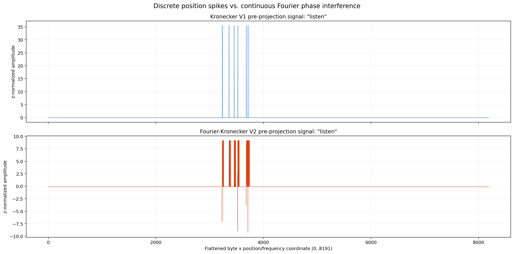
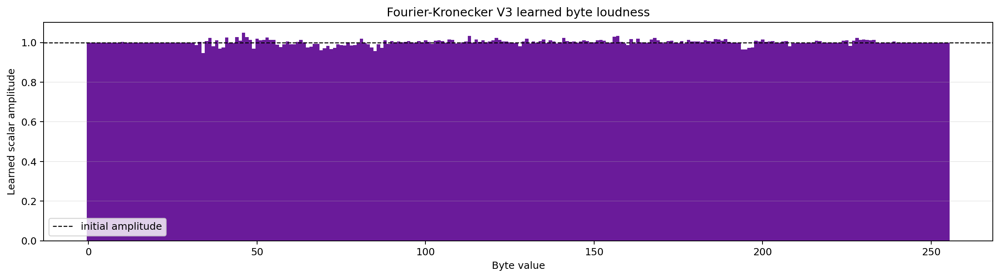
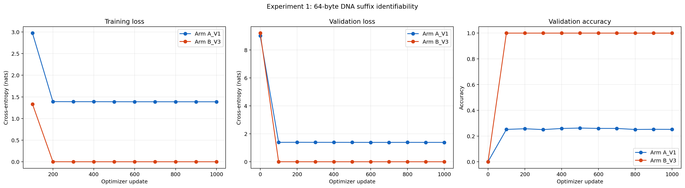
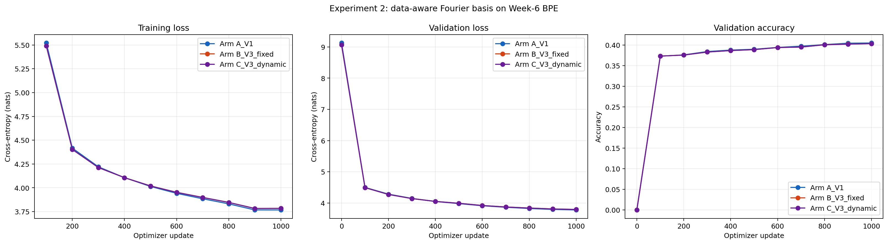
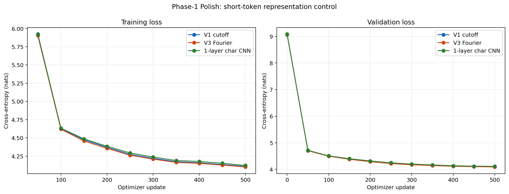
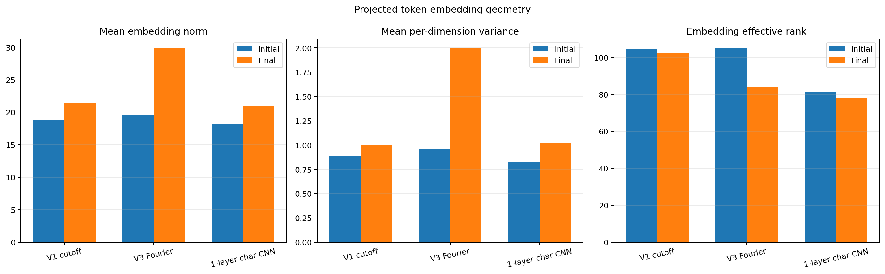
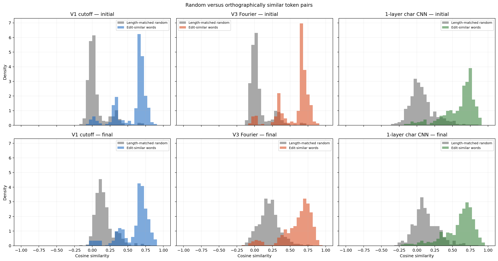
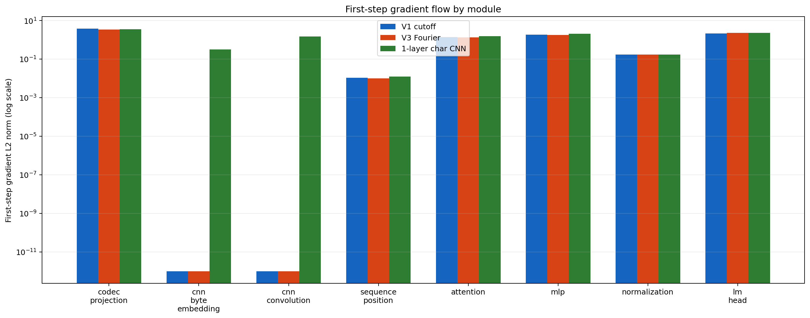

# Fourier-Kronecker Forward

## A fixed-dimensional, deterministic token embedding without a 32-byte cutoff

> **Assignment problem selected:** “What is a real Fourier alternative of Kronecker?”  
> We treat removal of the original 32-position crop as the central acceptance test for that alternative. We do not claim to solve the assignment’s separate mathematics, multimodal, or reverse-decoding problems in this phase.

This submission documents a complete research cycle rather than presenting only the successful endpoint:

1. we identified an information-destroying hard cutoff in the original Kronecker construction;
2. our first sinusoidal replacement failed through **basis collapse**;
3. we repaired the geometry with band-limited complex Euler phases and then calibrated it to the actual token-length distribution;
4. we discovered that a proposed dynamic “Loudness” mechanism conflicted with per-token normalization;
5. we validated the final V3 representation through controlled ~24.1M-parameter ablations, a causal long-token identifiability task, a character-CNN control, geometry audits, and identical-initialization hashes.

The result is not a claim that Fourier-Kronecker is injective for every possible byte string or already proven at frontier scale. It is a narrower and reproducible claim:

> **V3 removes V1’s hard within-token positional limit, preserves useful byte order, and remains operationally competitive on the overwhelmingly short tokens in the Week 6 BPE corpus.**

---

## Run the concept in one command

The grader demo requires only Python and PyTorch. It downloads nothing and does not use the Week 6 corpus.

```bash
python run_demo.py
```

Force CPU execution if desired:

```bash
python run_demo.py --device cpu
```

The script prints and asserts all of the following:

- V1 accepts a 64-byte input but encodes only 32 bytes;
- V3 encodes all 64 bytes;
- both representations retain the exact same `8192`-element output shape;
- two tokens sharing their first 32 bytes collide exactly under V1;
- those tokens are separated under V3 despite having suffixes with identical byte histograms;
- the naive V2 positional basis has poor effective rank and nearly collinear adjacent positions;
- global pre-normalization “Loudness” vanishes numerically;
- two controlled two-layer causal Transformers complete five forward/backward updates with finite losses and gradients.

Example final line:

```text
PASS: fixed shapes, suffix separation, and finite optimization verified.
```

The recorded CUDA run from an independent test environment is included at [`test_env_demo_output.txt`](test_env_demo_output.txt). The scientific pass criteria are the asserted invariants above; the five-step dummy losses are an implementation check, not a language-model benchmark.

Install PyTorch only if it is not already available:

```bash
python -m pip install -r requirements.txt
```

---

## 1. The problem: a discrete 32-byte wall

Let a token contain UTF-8 bytes

$$
t=(b_0,b_1,\ldots,b_{L-1}), \qquad b_p\in\{0,\ldots,255\}.
$$

The original Kronecker embedding uses:

- a 256-dimensional one-hot byte vector $c_{b_p}$;
- a 32-dimensional one-hot within-token position vector $q_p$;
- their Kronecker product $c_{b_p}\otimes q_p\in\mathbb{R}^{8192}$.

The token codec is

$$
K_{V1}(t)=
Z\!\left(
\frac{1}{\sqrt{\min(L,32)}}
\sum_{p=0}^{\min(L,32)-1}
c_{b_p}\otimes q_p
\right).
$$

Here and below, $Z$ denotes the per-token population Z-normalization defined explicitly in Section 4.

This construction is deterministic, sparse, and strongly order-sensitive. Its failure is equally precise: $q_p$ does not exist after position 31. The implementation therefore crops every token at byte 32.

If two tokens have the same first 32 bytes,

$$
t=u\,v, \qquad t'=u\,w, \qquad |u|=32,
$$

then

$$
K_{V1}(t)=K_{V1}(t')
$$

regardless of how different $v$ and $w$ are. This is a deterministic information collision, not an optimization problem that a larger Transformer can learn around.

The fixed `8192` dimensions are also allocated even for a one-byte token. We therefore wanted an analytic positional representation that retained the same projection interface without allocating a finite table or cropping long inputs.

---

## 2. Attempt 1: V2 naive Fourier

Our first replacement was Transformer-inspired rather than a reproduction of the canonical Transformer positional encoding. For 16 frequency pairs,

$$
\phi_{V2}(p)_{2k}=\cos(\omega_k p), \qquad
\phi_{V2}(p)_{2k+1}=\sin(\omega_k p),
$$

with the implemented schedule

$$
\omega_k=\tau^{-2k/16}, \qquad \tau=10{,}000, \qquad k\in\{0,\ldots,15\}.
$$

This denominator convention spans a wider range of denominators—and therefore reaches much slower frequencies—than the usual 32-channel canonical sinusoid. We then summed

$$
K_{V2}(t)=
Z\!\left(
\frac{1}{\sqrt L}
\sum_{p=0}^{L-1}
c_{b_p}\otimes\phi_{V2}(p)
\right).
$$

This succeeded mechanically:

- no position lookup table was required;
- every byte contributed;
- the output remained 8,192-dimensional.

It failed geometrically.

### Basis collapse

Most V2 frequencies moved too slowly over the byte windows that tokens actually occupied. Adjacent positions therefore produced almost the same direction. Robustness to small shifts had been purchased by discarding too much order information.

Measured over positions 0–255:

| Diagnostic | V2 naive |
|---|---:|
| Effective rank | `3.326 / 32` |
| Numerical rank | `13 / 32` |
| Condition number | `3.66 × 10²¹` |
| Adjacent-position cosine | `0.967823` |
| Maximum off-diagonal cosine | `0.967823` |

The collapse appeared directly in order probes:

| Pair | V1 cosine | V2 cosine |
|---|---:|---:|
| `cat` / `act` | 0.3331 | **0.9784** |
| `listen` / `silent` | 0.1661 | **0.9376** |

Anagrams were almost indistinguishable under V2. In the controlled 1,000-step Week 6 run, V2 also ended at validation loss `3.87503` versus V1’s `3.78520`, a `+2.37%` relative loss penalty.



This failure changed the research question. “Continuous” was not enough; the positional basis had to be explicitly conditioned over the receptive field that mattered.

Raw evidence: [`reports/v2_naive/experiment_report.json`](reports/v2_naive/experiment_report.json) and [`reports/v3_diagnostics/diagnostics.json`](reports/v3_diagnostics/diagnostics.json).

---

## 3. The pivot: V3 FoPE-style conditioning plus Euler directionality

V3 retains both real components of Euler’s complex phase:

$$
e^{i\omega_kp}=\cos(\omega_kp)+i\sin(\omega_kp).
$$

We store each complex direction as two adjacent real channels:

$$
\phi_{V3}(p)=
[\cos(\omega_0p),\sin(\omega_0p),\ldots,
\cos(\omega_{15}p),\sin(\omega_{15}p)]
\in\mathbb{R}^{32}.
$$

Sine/cosine pairing was already present in V2, so Euler pairing alone cannot explain the repair. The decisive V3 change was to condition the frequency spectrum over the byte windows of interest; the paired channels then retained the direction of phase movement within that conditioned spectrum.

The byte-position term is still a Kronecker product:

$$
c_{b_p}\otimes\phi_{V3}(p)\in\mathbb{R}^{256\cdot32}
=\mathbb{R}^{8192},
$$

and the complete token is

$$
K_{V3}(t)=
Z\!\left(
\frac{1}{\sqrt L}
\sum_{p=0}^{L-1}
c_{b_p}\otimes\phi_{V3}(p)
\right).
$$

Here $Z$ is per-token Z-normalization. Position is evaluated analytically, so $p=32$, $p=64$, and $p=1024$ require no new learned table and no change to the output shape.

### Step 3A: anchored, band-limited geometric repair

The first successful V3 schedule combined one long global wavelength with 15 band-limited local frequencies. Instead of filling the basis with near-constant low frequencies, the local band covered meaningful phase changes at byte scale.

Over positions 0–255, this changed:

| Diagnostic | V2 naive | V3 band-limited |
|---|---:|---:|
| Effective rank | 3.326 | **31.820** |
| Numerical rank | 13 | **32** |
| Condition number | 3.66 × 10²¹ | **1.289** |
| Position-0/1 cosine | 0.9678 | **0.4654** |

The complex sine/cosine pair retains phase direction. A cosine-only representation cannot distinguish positive from negative phase displacement as cleanly; the paired quadrature direction makes local movement explicit in the real vector space. The ablation establishes the success of the complete V3 basis design, but it does not separately estimate a causal contribution for Euler pairing because both V2 and V3 use paired channels.

### Step 3B: data-aware calibration

The Week 6 BPE corpus never exercises 256-byte tokens in the measured stream: `98.74%` of observed token occurrences are eight bytes or fewer, the remainder are 9–14 bytes, and none exceed 14 bytes. Optimizing only a 0–255 window therefore caused a receptive-field mismatch.

The final schedule was selected without consulting LM validation loss. A deterministic search perturbed the well-conditioned DCT midpoint grid with a low-discrepancy golden-ratio pattern and optimized a surrogate over 8, 16, and 32-byte windows. The weights were derived from the empirical training-token length distribution, with an explicit 5% floor on the 32-byte term to preserve longer-window conditioning even though no observed training-token occurrences exceeded 16 bytes.

| Window | Effective rank | Ceiling | Condition number |
|---:|---:|---:|---:|
| 8 bytes | `7.99999` | 8 | `1.0021` |
| 16 bytes | `15.91635` | 16 | `1.1879` |
| 32 bytes | `30.76950` | 32 | `1.5081` |

This chronology is important: the conceptual pivot was band-limited FoPE-style frequency control; the final short-token implementation refined it with a data-aware DCT perturbation rather than retaining a purely geometric spacing.

Search artifact: [`reports/dual_proof/frequency_search.json`](reports/dual_proof/frequency_search.json).

---

## 4. The Loudness paradox: a useful negative result

We next proposed a learned byte amplitude $a_b$:

$$
x(t;a)=
\frac{1}{\sqrt L}
\sum_p a_{b_p}
\left(c_{b_p}\otimes\phi(p)\right).
$$

The intuition was acoustic: phase would encode “where,” while amplitude would learn “how loudly” each byte should contribute.

The problem is the normalization applied immediately afterward. For

$$
Z_\epsilon(x)=\frac{x-\mu(x)}{\sqrt{\operatorname{Var}(x)+\epsilon}},
$$

and positive scalar $\lambda$, the idealized zero-epsilon normalization satisfies

$$
Z_0(\lambda x)=Z_0(x).
$$

With nonzero $\epsilon$, the identity is approximate rather than exact; the included demo measures a maximum coordinate difference of only `1.86 × 10⁻⁵` between $Z_\epsilon(x)$ and $Z_\epsilon(7x)$. Therefore, **global pre-normalization loudness is mathematically unidentifiable in the zero-epsilon limit and numerically suppressed in the implemented normalization**. Relative byte-specific gates can still rotate the vector, so it is more precise to say that normalization erases global amplitude while changing the meaning of relative amplitude; it does not erase every possible nonuniform gate identically.

Empirically, the final short-token ablation found almost no benefit:

| V3 arm | Validation loss |
|---|---:|
| Fixed amplitude | `3.795829` |
| Dynamic amplitude | `3.795771` |
| Difference | `−0.000058` nats |

That difference is operationally negligible. Loudness was therefore removed from the main V3 claim rather than retroactively presented as a success.

A mathematically identifiable future variant would normalize geometry first and apply a constrained relative gate afterward, with no second normalization. That is Phase 2 work, not part of this submission.



Raw evidence: [`reports/v3_diagnostics/loudness_training_report.json`](reports/v3_diagnostics/loudness_training_report.json) and [`reports/dual_proof/short_token_report.json`](reports/dual_proof/short_token_report.json).

---

## 5. The dual empirical proof

We used two experiments because the original Week 6 vocabulary and the long-token claim test different regimes. The reported dual proof used a six-layer, six-head Transformer with model width 384, MLP ratio 8, block size 256, effective batch size 32, and `24,094,720` stored trainable parameters. Every arm was re-created with seed `7007`; the common initial-state SHA-256 was `3d7b85701b4dbab2a71e5a287607fc4cf50991cc71d2d56627b1718547dd20b2`.

### 5.1 Long-token causal identifiability

The controlled task uses 64-byte DNA tokens. Four tokens share exactly the same first 32 bytes and differ only in their suffix order. Each suffix has the same number of `A`, `C`, `G`, and `T` bytes, so the task cannot be solved using aggregate byte counts. The next causal target is a balanced four-way suffix label.

V1 sees the same input representation for all four cases. Its information-theoretic optimum is therefore

$$
L^*_{V1}=\ln4=1.386294, \qquad A^*_{V1}=25\%.
$$

V3 sees the suffix phase.

| Arm | Final validation loss | Accuracy | Pairwise suffix distance |
|---|---:|---:|---:|
| V1 cutoff | `1.386362` | `25.19%` | exactly `0.0` |
| V3 Fourier | `2.98 × 10⁻¹⁰` | `100.00%` | minimum `48.20` |

V1 lands almost exactly on its theoretical floor. V3 solves the suffix-prediction task.

This is a causal identifiability experiment, not a claim of natural genomic language-model performance. In the reported run, 32-byte prefixes came from the Hugging Face Dataset Viewer (`shivendrra/EnigmaDataset`, train split); the balanced 32-byte suffixes and four-way labels were deliberately constructed controls.



Raw evidence: [`reports/dual_proof/long_token_report.json`](reports/dual_proof/long_token_report.json).

### 5.2 Short-token operational parity

On the Week 6 standard-BPE corpus, all models used the same ~24.1M-parameter Transformer, optimizer, seeded batch order, and step-zero stored trainable state. The dynamic arm activated its 256 amplitude parameters; those parameters were stored but inert in V1 and fixed-amplitude V3. The complete initial SHA-256 was identical across arms.

The 1,000-step dual-proof run produced:

| Arm | Validation loss | Accuracy |
|---|---:|---:|
| V1 | `3.779082` | `40.503%` |
| V3 data-aware, fixed | `3.795829` | `40.337%` |
| V3 data-aware, dynamic | `3.795771` | `40.337%` |

V3’s fixed-amplitude penalty was `0.01675` nats, approximately a `1.68%` perplexity ratio. We call this **operational parity**, not statistical equivalence: it is one controlled seed and remains a small measured deficit.



---

## 6. Final polish: the missing character-CNN control

A reviewer can correctly object that any order-sensitive, untruncated encoder might solve the task. We therefore added a one-layer width-3 character CNN as a local convolutional control and audited projected representation geometry.

All three models stored the same `24,123,264` parameter values with identical initialization:

```text
b8b1a791e09c21eef0f0919418c20302b78b095b4500d626d8a37ea81f960e3a
```

The CNN parameters were present but inert in V1/V3 and active only in the CNN arm. Consequently, this is a functional baseline, **not an effective-parameter-matched control**: V1 and V3 activated `24,094,464` parameter elements on the first step, whereas the CNN activated all `24,123,264`. The report exposes active and nonzero gradient counts so identical storage and initialization are not mistaken for identical effective capacity.

After 500 updates:

| Arm | Validation loss | Accuracy | Mean throughput |
|---|---:|---:|---:|
| **V3 Fourier** | **`4.09175`** | `38.379%` | **46,666 tok/s** |
| V1 cutoff | `4.09535` | **`38.496%`** | 44,363 tok/s |
| Character CNN | `4.11332` | `38.462%` | 39,432 tok/s |

V3 finished `0.00360` nats ahead of V1 and `0.02157` nats ahead of the CNN. From a single seed this is not evidence of statistically significant superiority. It does show that the Fourier result is not trivially dominated by a lightweight local convolution and that V3 remains competitive under the short-token distribution.



### Geometry audit

| Final metric | V1 | V3 | CNN |
|---|---:|---:|---:|
| Mean embedding norm | 21.49 | **29.81** | 20.92 |
| Mean per-dimension variance | 1.00 | **1.99** | 1.02 |
| Effective rank | **102.48** | 83.88 | 78.12 |
| Similar-minus-random cosine | 0.435 | 0.399 | **0.460** |
| Reversal sensitivity $1-\cos$ | 0.655 | 0.664 | **0.676** |

The result is deliberately not simplified into “V3 has better geometry.” V3’s projected representation becomes higher-energy and more anisotropic during training: its effective rank falls while its variance increases. The CNN has the strongest surface-form clustering and reversal sensitivity but the worst language-model loss. Surface similarity alone is therefore insufficient to explain LM performance.





### Gradient audit

All first-step gradients were finite. Total gradient norms were similar:

- V1: `4.930`
- V3: `4.717`
- CNN: `5.130`

The CNN convolution norm was `1.489`; V1 and V3 had exactly zero CNN gradients, as required. V3’s result is therefore not explained by a grossly larger first-step gradient.



Raw evidence: [`reports/polish/metrics.json`](reports/polish/metrics.json).

---

## 7. What has—and has not—been proven

### Supported by Phase 1

- V1 deterministically loses all information after byte 32.
- V2’s naive low-frequency sinusoidal schedule is badly conditioned for byte-scale order.
- Band-limited, data-conditioned frequencies repair the observed positional basis collapse; paired Euler channels retain phase direction but were not separately ablated.
- Data-aware frequency calibration can fit the receptive field of short BPE tokens.
- V3 has no architecture-level 32-byte position table: it analytically encodes any finite byte sequence allowed by runtime resources while retaining a fixed 8,192-dimensional interface. Phase 1 explicitly tested lengths through 1,024 bytes and does not claim injectivity or unlimited floating-point precision.
- On the controlled 64-byte suffix task, V1 reaches its information ceiling while V3 reaches 100% accuracy.
- On the Week 6 short-token corpus, V3 is operationally competitive with V1 and a one-layer character CNN.
- Pre-normalization global amplitude is exactly unidentifiable at zero normalization epsilon and numerically suppressed at the implemented nonzero epsilon.

### Not claimed

- The 8,192-dimensional sum is not proven injective for all possible strings.
- V3 does not remove the fixed output vocabulary or LM head.
- The long-token experiment is not natural genomic pretraining.
- One training seed does not establish statistical superiority.
- Phase 1 does not demonstrate 124M+ scaling, multimodality, exact arithmetic, or reverse decoding.

These boundaries are part of the result. They separate the demonstrated architecture from interesting Phase 2 hypotheses.

---

## 8. Reproducing the full experiments

The quick demo is self-contained. The full scripts are retained under [`scripts/`](scripts/) and require PyTorch, NumPy, and Matplotlib. The exact Week 6 V2 tokenizer and train/validation token streams used by the reported short-token experiments are now bundled under [`data/week6_v2/`](data/week6_v2/). Every script discovers these package-local artifacts first, so no author-specific directory or download is required. Alternative corpora can still be supplied with `--tokenizer-json`, `--train-tokens`, and `--val-tokens`.

The bundled short-token data comprise an 8,192-entry byte-fallback tokenizer, 6,114,695 little-endian `uint16` training IDs, and 716,531 validation IDs (15.13 MiB total). [`data/week6_v2/SHA256SUMS.txt`](data/week6_v2/SHA256SUMS.txt) records integrity hashes, and [`data/week6_v2/README.md`](data/week6_v2/README.md) documents the format. The exact 2,046 genomic prefixes used by the reported long-token run are also included at [`data/long_tokens/long_dna_prefixes.json`](data/long_tokens/long_dna_prefixes.json), with provenance and checksum documentation in [`data/long_tokens/README.md`](data/long_tokens/README.md).

### V2 failure and constructive diagnostics

```bash
python scripts/fourier_kronecker_v2_experiment.py --smoke-test
python scripts/fourier_kronecker_v3_diagnostics.py
```

### Original V3 and Loudness experiment

```bash
python scripts/fourier_kronecker_v3_training.py --smoke-test
```

### Dual proof

```bash
python scripts/fourier_kronecker_phase1_dual_proof.py --experiment long --smoke-test --long-source synthetic
```

That long-only command is intrinsically data-free. The V2, V3-Loudness, short-token, and CNN-polish commands use the bundled Week 6 artifacts automatically; `--smoke-test` reduces their model size and steps but still exercises the real packaged corpus.

The default dual-proof command runs the complete 1,000-step experiments using the bundled Week 6 corpus and the exact bundled genomic-prefix cache, so it requires no data download:

```bash
python scripts/fourier_kronecker_phase1_dual_proof.py
```

### Final V1/V3/CNN geometry ablation

```bash
python scripts/phase1_polish_representation_ablation.py --smoke-test
python scripts/phase1_polish_representation_ablation.py
```

The reported full experiments used:

- FP16 automatic mixed precision on CUDA;
- fused AdamW when available;
- PyTorch scaled-dot-product causal attention;
- deterministic model reinitialization before every arm;
- SHA-256 comparison of complete trainable state;
- JSON reports as the source of truth for tables and plots.

Large model checkpoints are intentionally omitted. The exact tokenizer and token streams, JSON reports, figures, source scripts, checksum manifest, and data-free demo are included.

---

## 9. Submission map

```text
Phase_1_Fourier_Forward/
├── .gitignore
├── README.md
├── requirements.txt
├── run_demo.py
├── test_env_demo_output.txt
├── data/
│   ├── long_tokens/
│   │   ├── README.md
│   │   ├── SHA256SUMS.txt
│   │   └── long_dna_prefixes.json
│   └── week6_v2/
│       ├── README.md
│       ├── SHA256SUMS.txt
│       ├── tokenizer.json
│       ├── train/
│       │   └── tokens.uint16.bin
│       └── validation/
│           └── tokens.uint16.bin
├── scripts/
│   ├── fourier_kronecker_v2_experiment.py
│   ├── fourier_kronecker_v3_diagnostics.py
│   ├── fourier_kronecker_v3_training.py
│   ├── fourier_kronecker_phase1_dual_proof.py
│   └── phase1_polish_representation_ablation.py
├── reports/
│   ├── v2_naive/
│   │   ├── experiment_report.json
│   │   └── proof_metrics.json
│   ├── v3_diagnostics/
│   │   ├── diagnostics.json
│   │   └── loudness_training_report.json
│   ├── dual_proof/
│   │   ├── frequency_search.json
│   │   ├── long_token_report.json
│   │   ├── master_report.json
│   │   └── short_token_report.json
│   └── polish/
│       └── metrics.json
└── figures/
    ├── v2_naive/
    │   └── fourier_interference.png
    ├── v3/
    │   ├── training_loss_curves.png
    │   └── v3_byte_amplitudes.png
    ├── dual_proof/
    │   ├── long_token_loss_curves.png
    │   └── short_token_loss_curves.png
    └── polish/
        ├── byte_reversal_sensitivity.png
        ├── embedding_geometry.png
        ├── first_step_gradients.png
        ├── pair_cosine_distributions.png
        └── training_curves.png
```

---

## Final conclusion

The project did not succeed because the first Fourier idea worked. It succeeded because that idea failed in a measurable way.

Naive V2 removed the crop but collapsed positional directions. V3 repaired that failure by treating frequencies as a conditioned basis-design problem rather than importing a generic sinusoid. The data-aware refinement reconciled long positional support with the short receptive field of standard BPE. The Loudness experiment then supplied a second negative result: normalization can make an apparently expressive parameter mathematically unidentifiable.

The final evidence is correspondingly narrow but strong. Under identical stored trainable initialization, V3 retains all 64 bytes in the causal proof where V1 is forced to chance, while remaining competitive with V1 and a character CNN on short-token language modeling.

That completes Phase 1: **Fourier forward composition works in the tested settings, the hard cutoff is removed, and the principal failure modes are characterized.** The mathematical checks, integration demo, and short-token experiment code can now be rerun from this package alone; exact stochastic training trajectories may still vary across PyTorch, CUDA, and GPU versions.
